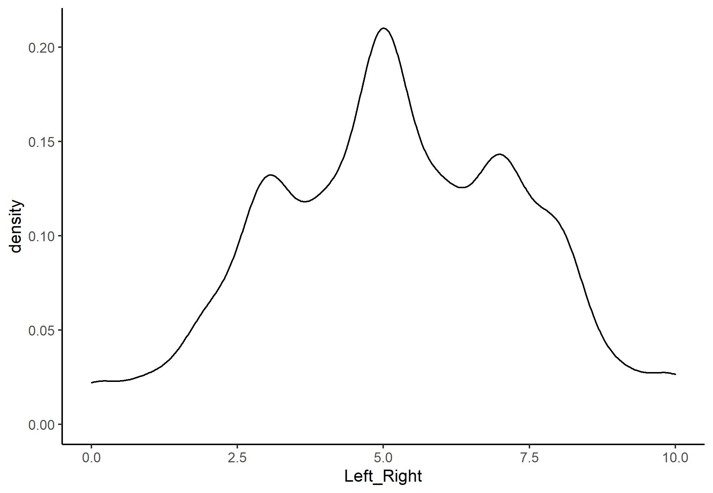
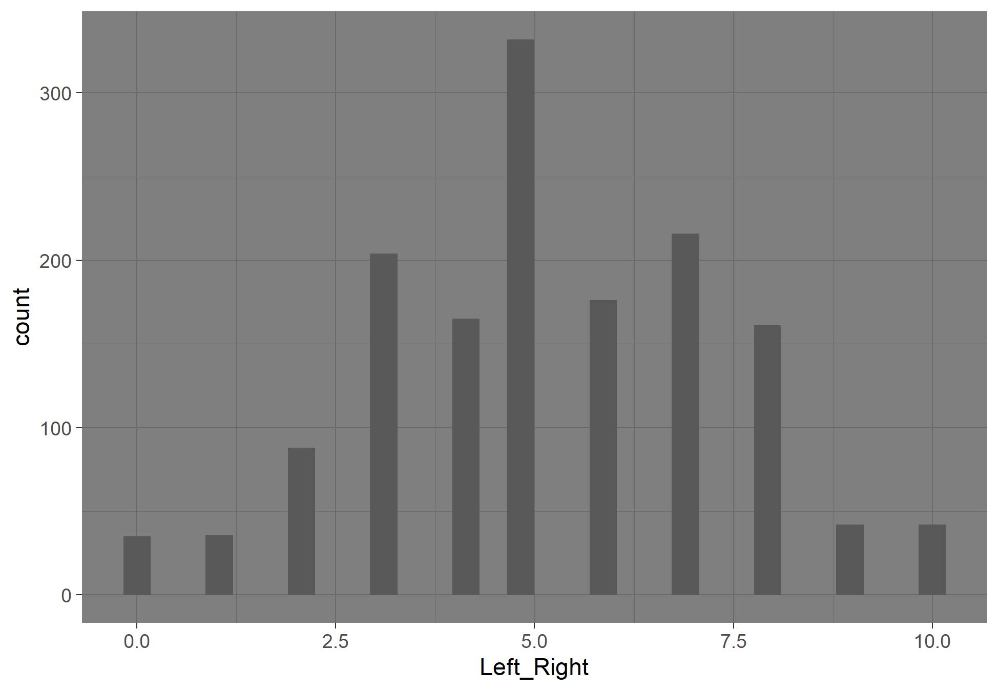
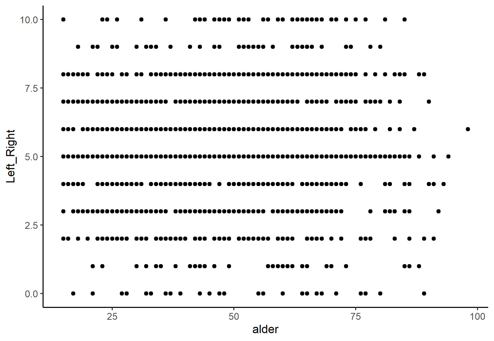
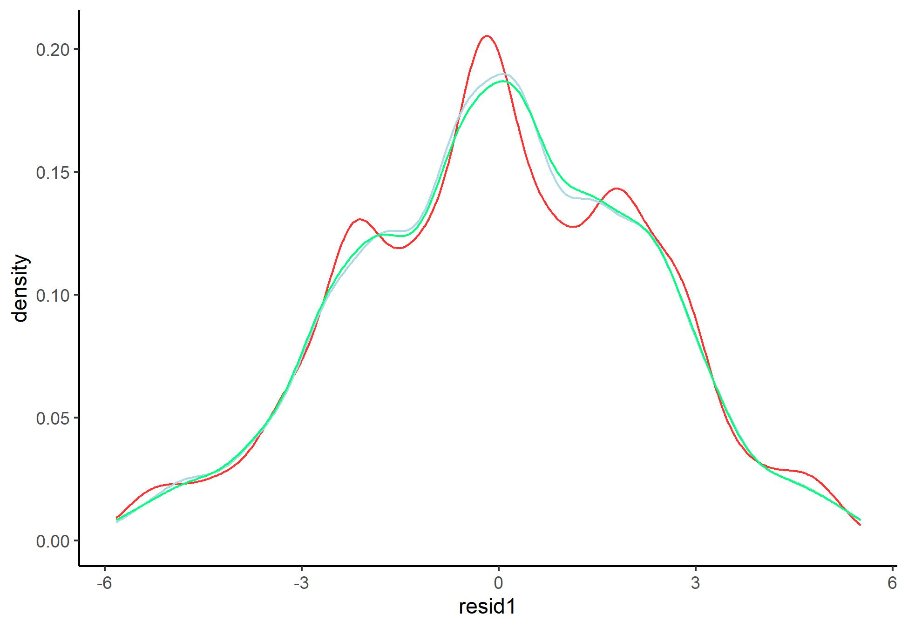

# Oppgave 1

Som vanlig må vi begynne med å laste inn data og pakker. Så velger vi ut ett land og en runde, jeg velger
Norge i runde 8

```{r}
library(tidyverse)
library(stargazer)
ESS <- read.csv("https://raw.githubusercontent.com/egen97/4020A_RSeminar/master/ESS_Selected.csv")

NO8 <- ESS %>%
  filter(Country == "NO" & essround == 8)

#Velger så ut noen variabler jeg synes er spennende

NO8 <- NO8 %>%
  select(Country, Age, Left_Right, Income, Gender, Basic_Income, Climate_Human)
```


# Oppgave 2

2. Få en oversikt over variablene dine, og se om de er slik du ønsker. Prøv å gjøre om en til
  en dikotom variabel, og skifte navn på noen av variablene, i tillegg til annet du skulle føle
  er nødvendig. 
  
```{r}
#Vi har sett på noen forskjellige måter å få en oversikt over datasettet på. Her viser jeg frem noen, men ossen vi bruker
#dem har vi gått igjennom flere ganger. Om dere lurer på noe etter å ha sett resultatet kan dere sende en e-post/canvas-melding :)

str(NO8)
head(NO8)
tail(NO8)
summary(NO8)
```


Her legger jeg til en dikotom variabel som viser om du har høyere enn gjennomsnittelig inntekt, og endrer noen få navn. Ellers 
mener jeg datasettet ser rimelig greit ut. 

```{r}

NO8 <- NO8 %>%
  mutate(HighInc = ifelse(Income > mean(Income, na.rm = TRUE), 1, 0)) %>%
  rename(
    "kjonn" = "Gender", 
    "alder" = "Age",
    "land" = "Country"
  )
```

# Oppgave 3

3. Finn en variabel, og utfør noe univariat statistikk. Se om du kan få det både presentert i tall, og
   gjennom grafer. 
   

Her kan vi se på individenes politiske plassering på høyre-venstre skalaen. 

```{r}
#For gjennomsnitt, median, etc. bruker jeg bare summary()

summary(NO8$Left_Right)

#Så bruker jeg sd() for å finne standarddeviasjon

sd(NO8$Left_Right, na.rm = TRUE)
```


Det er flere grader vi kan bruke for å presentere dette. De vanligste er density, og et histogram. Vi har som oftest
fokusert på førstnevnte, men viser begge to. 

```{r, message=FALSE, warning=FALSE,include=FALSE}
ggplot(NO8, aes(Left_Right)) +
  geom_density() +
  theme_classic()

ggsave("NOdens.jpeg")

ggplot(NO8, aes(Left_Right)) +
  geom_histogram()+
  theme_dark()

ggsave("NOhist.jpeg")
```





# Oppgave 4

4. Finn to variabler du mener kan ha en sammenheng. Gjør en korrelasjonstest, og en grafisk presentasjon av
   den eventuelle sammenhengen. 
   
   
Her kommer jeg til å se på hvorvidt det er en sammenheng mellom alder og politisk plassering

```{r}
cor.test(NO8$Left_Right, NO8$alder)
```

Her det viktig å kunne tolke resultatet vårt. Vi ser at korrelasjonen vår er på 0.06 (rundet opp), det betyr at vi har svak positiv effekt. Vi har også en p-verdi på 0.02. Vanligvis sier vi at vi har en signifikant effekt om p < 0.05, så dette kan sies å være et reelt funn. 


For å plotte sammenhengen kan vi bruke et vanlig scatter-plot

```{r, include= FALSE, warning=FALSE, message=FALSE}
ggplot(NO8, aes(alder, Left_Right)) +
  geom_point()+
  theme_classic()
ggsave("AldLef.jpeg")
```



# Oppgave 5

5. Lag minst tre regresjoner. Start med kun de to variablene du ønsker å undersøke, og så legg til kontrollvariabler
   en og en. Presentert disse modellene sammen, og tolk resultatet. 
   
   
Her kan vi se på hvorvidt politisk plassering påvirkes av alder, og så kontrolere for kjønn og hvorvidt de har over gjennomsnittelig inntekt

```{r, warning=FALSE, message=FALSE}
  Mod1 <- lm(Left_Right ~ alder, NO8, na.action = "na.exclude")
  Mod2 <- lm(Left_Right ~ alder + kjonn, NO8, na.action = "na.exclude")
  Mod3 <- lm(Left_Right ~ alder + kjonn + HighInc, NO8, na.action = "na.exclude")
  
  
#Så kan vi bruke stargazer for å vise dem frem
  
stargazer(Mod1, Mod2, Mod3, type = "text")
```


Modellen vår tar vel her å bekrefter det kjente Churchill sitatet:
*‘If you’re not a liberal when you’re 25, you have no heart.  If you’re not a conservative by the time you’re 35, you have no brain.’*
Alder har i den første modellen en positiv effekt (og her er høyere tall mer til høyre) på 0.07, og denne er signifikant på 0.05 nivå. Den er lik i modell 2, og såvidt noe større i modell 3, samtidig som signifikansnivået holder seg likt gjennom alle modellene. 


Kjønn har en negativ effekt, så vi ser at menn (kodet 0) er noe mer venstrevridde enn kvinner. Denne er signifikant på 0.01 nivå, men effekten blir noe svakere når vi kontrollerer for hvorvidt man har høyere inntekt enn gjenomsnittet. 

Til slutt ser vi at de som har høyere enn gjennomsnittelig inntekt er generelt noe mer høyrevridde, men denne har en p-verdi på 0.1 så her har vi ikke grunn til å forkaste nullhypotesen. Her er det altså ikke en grunn til å tro at effekten er reel. 
Vi ser også at $r^2$ er på 0.003 for modell en, og øker kraftig til modell to til 0.027, og så svakt i model 3 til 0.029. Altså forklarer vi mer varians når vi legger til flere variabler. 


# Oppgave 6

6. Undersøk om restleddene er normalfordelte for de (minst) tre modellene. 


```{r, warning=FALSE, include=FALSE}

#For å hente ut residualene bruker jeg funksjonen resid()

NO8 <- NO8 %>%
  mutate(
    resid1 = resid(Mod1),
    resid2 = resid(Mod2),
    resid3 = resid(Mod3)
  )

#Nå som jeg har residualene kan jeg plotte disse, her plotter jeg dem sammen!

ggplot(NO8) +
  geom_density(aes(resid1), colour = "firebrick1") +
  geom_density(aes(resid2), colour = "lightblue") +
  geom_density(aes(resid3), colour = "springgreen1") +
  theme_classic()

ggsave("residall.jpeg")
```


Her ser vi at for alle modellene er residualene sånn "ish" normalfordelte, modell 2 og 3 noe nærmere enn modell 1. Her kan vi vel si at det er så nærme at modellene er innafor å bruke. Dette er jo en ren tolkningssak og avhenger av hva du forventer av modellen.

