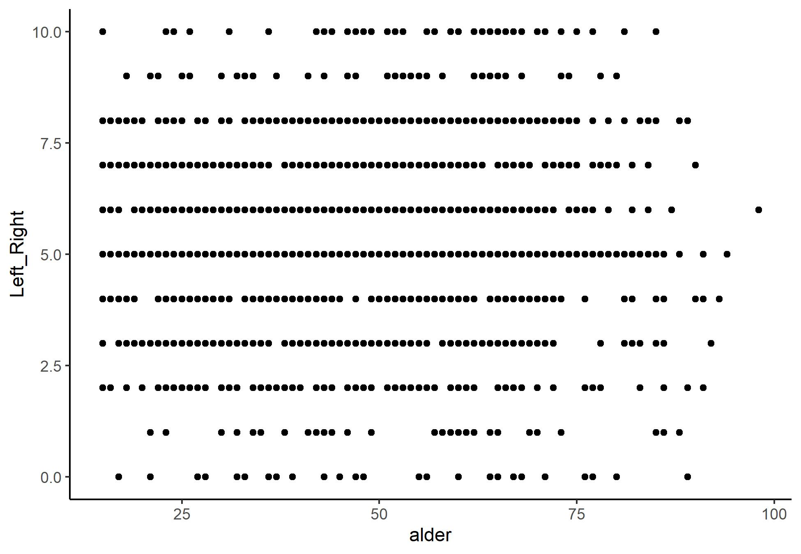

# Oppgave 1

Som vanlig må vi begynne med å laste inn data og pakker. Så velger vi ut ett land og en runde, jeg velger
Norge i runde 8


```r
library(tidyverse)
```

```
## -- Attaching packages --------------------------------------- tidyverse 1.3.0 --
```

```
## v ggplot2 3.3.2     v purrr   0.3.4
## v tibble  3.0.4     v dplyr   1.0.2
## v tidyr   1.1.2     v stringr 1.4.0
## v readr   1.4.0     v forcats 0.5.0
```

```
## -- Conflicts ------------------------------------------ tidyverse_conflicts() --
## x dplyr::filter() masks stats::filter()
## x dplyr::lag()    masks stats::lag()
```

```r
library(stargazer)
```

```
## 
## Please cite as:
```

```
##  Hlavac, Marek (2018). stargazer: Well-Formatted Regression and Summary Statistics Tables.
```

```
##  R package version 5.2.2. https://CRAN.R-project.org/package=stargazer
```

```r
ESS <- read.csv("https://raw.githubusercontent.com/egen97/4020A_RSeminar/master/ESS_Selected.csv")

NO8 <- ESS %>%
  filter(Country == "NO" & essround == 8)

#Velger så ut noen variabler jeg synes er spennende

NO8 <- NO8 %>%
  select(Country, Age, Left_Right, Income, Gender, Basic_Income, Climate_Human)
```


# Oppgave 2

2. Få en oversikt over variablene dine, og se om de er slik du ønsker. Prøv å gjøre om en til
  en dikotom variabel, og skifte navn på noen av variablene, i tillegg til annet du skulle føle
  er nødvendig. 
  

```r
#Vi har sett på noen forskjellige måter å få en oversikt over datasettet på. Her viser jeg frem noen, men ossen vi bruker
#dem har vi gått igjennom flere ganger. Om dere lurer på noe etter å ha sett resultatet kan dere sende en e-post/canvas-melding :)

str(NO8)
```

```
## 'data.frame':	1545 obs. of  7 variables:
##  $ Country      : chr  "NO" "NO" "NO" "NO" ...
##  $ Age          : int  74 17 54 50 25 43 45 75 27 62 ...
##  $ Left_Right   : int  5 5 2 4 5 5 3 7 6 7 ...
##  $ Income       : int  4 9 5 6 2 1 5 3 10 4 ...
##  $ Gender       : int  1 1 1 2 1 1 2 2 2 1 ...
##  $ Basic_Income : int  2 2 2 3 3 3 2 1 2 2 ...
##  $ Climate_Human: int  4 3 4 4 4 3 3 3 3 3 ...
```

```r
head(NO8)
```

```
##   Country Age Left_Right Income Gender Basic_Income Climate_Human
## 1      NO  74          5      4      1            2             4
## 2      NO  17          5      9      1            2             3
## 3      NO  54          2      5      1            2             4
## 4      NO  50          4      6      2            3             4
## 5      NO  25          5      2      1            3             4
## 6      NO  43          5      1      1            3             3
```

```r
tail(NO8)
```

```
##      Country Age Left_Right Income Gender Basic_Income Climate_Human
## 1540      NO  36          6      5      1            3             4
## 1541      NO  26          4      2      1            3             3
## 1542      NO  29          4      4      1            3             3
## 1543      NO  81          4      8      1            2             3
## 1544      NO  44         10     10      1            1             1
## 1545      NO  23          1      5      2           NA             5
```

```r
summary(NO8)
```

```
##    Country               Age          Left_Right         Income      
##  Length:1545        Min.   :15.00   Min.   : 0.000   Min.   : 1.000  
##  Class :character   1st Qu.:31.00   1st Qu.: 4.000   1st Qu.: 3.000  
##  Mode  :character   Median :47.00   Median : 5.000   Median : 5.000  
##                     Mean   :46.96   Mean   : 5.209   Mean   : 5.263  
##                     3rd Qu.:61.00   3rd Qu.: 7.000   3rd Qu.: 7.000  
##                     Max.   :98.00   Max.   :10.000   Max.   :10.000  
##                                     NA's   :48       NA's   :80      
##      Gender       Basic_Income   Climate_Human   
##  Min.   :1.000   Min.   :1.000   Min.   : 1.000  
##  1st Qu.:1.000   1st Qu.:2.000   1st Qu.: 3.000  
##  Median :1.000   Median :2.000   Median : 3.000  
##  Mean   :1.463   Mean   :2.189   Mean   : 3.434  
##  3rd Qu.:2.000   3rd Qu.:3.000   3rd Qu.: 4.000  
##  Max.   :2.000   Max.   :4.000   Max.   :55.000  
##                  NA's   :57      NA's   :20
```


Her legger jeg til en dikotom variabel som viser om du har høyere enn gjennomsnittelig inntekt, og endrer noen få navn. Ellers 
mener jeg datasettet ser rimelig greit ut. 


```r
NO8 <- NO8 %>%
  mutate(HighInc = ifelse(Income > mean(Income, na.rm = TRUE), 1, 0)) %>%
  rename(
    "kjonn" = "Gender", 
    "alder" = "Age",
    "land" = "Country"
  )
```

# Oppgave 3

3. Finn en variabel, og utfør noe univariat statistikk. Se om du kan få det både presentert i tall, og
   gjennom grafer. 
   

Her kan vi se på individenes politiske plassering på høyre-venstre skalaen. 


```r
#For gjennomsnitt, median, etc. bruker jeg bare summary()

summary(NO8$Left_Right)
```

```
##    Min. 1st Qu.  Median    Mean 3rd Qu.    Max.    NA's 
##   0.000   4.000   5.000   5.209   7.000  10.000      48
```

```r
#Så bruker jeg sd() for å finne standarddeviasjon

sd(NO8$Left_Right, na.rm = TRUE)
```

```
## [1] 2.219499
```


Det er flere grader vi kan bruke for å presentere dette. De vanligste er density, og et histogram. Vi har som oftest
fokusert på førstnevnte, men viser begge to. 


# Oppgave 4

4. Finn to variabler du mener kan ha en sammenheng. Gjør en korrelasjonstest, og en grafisk presentasjon av
   den eventuelle sammenhengen. 
   
   
Her kommer jeg til å se på hvorvidt det er en sammenheng mellom alder og politisk plassering


```r
cor.test(NO8$Left_Right, NO8$alder)
```

```
## 
## 	Pearson's product-moment correlation
## 
## data:  NO8$Left_Right and NO8$alder
## t = 2.3183, df = 1495, p-value = 0.02057
## alternative hypothesis: true correlation is not equal to 0
## 95 percent confidence interval:
##  0.009214916 0.110181176
## sample estimates:
##        cor 
## 0.05985113
```

Her det viktig å kunne tolke resultatet vårt. Vi ser at korrelasjonen vår er på 0.06 (rundet opp), det betyr at vi har svak positiv effekt. Vi har også en p-verdi på 0.02. Vanligvis sier vi at vi har en signifikant effekt om p < 0.05, så dette kan sies å være et reelt funn. 


For å plotte sammenhengen kan vi bruke et vanlig scatter-plot





# Oppgave 5

5. Lag minst tre regresjoner. Start med kun de to variablene du ønsker å undersøke, og så legg til kontrollvariabler
   en og en. Presentert disse modellene sammen, og tolk resultatet. 
   
   
Her kan vi se på hvorvidt politisk plassering påvirkes av alder, og så kontrolere for kjønn og hvorvidt de har over gjennomsnittelig inntekt


```r
  Mod1 <- lm(Left_Right ~ alder, NO8, na.action = "na.exclude")
  Mod2 <- lm(Left_Right ~ alder + kjonn, NO8, na.action = "na.exclude")
  Mod3 <- lm(Left_Right ~ alder + kjonn + HighInc, NO8, na.action = "na.exclude")
  
  
#Så kan vi bruke stargazer for å vise dem frem
  
stargazer(Mod1, Mod2, Mod3, type = "text")
```

```
## 
## ============================================================================================
##                                               Dependent variable:                           
##                     ------------------------------------------------------------------------
##                                                    Left_Right                               
##                              (1)                     (2)                      (3)           
## --------------------------------------------------------------------------------------------
## alder                      0.007**                 0.007**                  0.008**         
##                            (0.003)                 (0.003)                  (0.003)         
##                                                                                             
## kjonn                                             -0.704***                -0.693***        
##                                                    (0.114)                  (0.117)         
##                                                                                             
## HighInc                                                                      0.214*         
##                                                                             (0.118)         
##                                                                                             
## Constant                   4.874***                5.924***                 5.764***        
##                            (0.155)                 (0.229)                  (0.248)         
##                                                                                             
## --------------------------------------------------------------------------------------------
## Observations                1,497                   1,497                    1,427          
## R2                          0.004                   0.029                    0.031          
## Adjusted R2                 0.003                   0.027                    0.029          
## Residual Std. Error   2.216 (df = 1495)       2.189 (df = 1494)        2.196 (df = 1423)    
## F Statistic         5.375** (df = 1; 1495) 21.971*** (df = 2; 1494) 14.962*** (df = 3; 1423)
## ============================================================================================
## Note:                                                            *p<0.1; **p<0.05; ***p<0.01
```


Modellen vår tar vel her å bekrefter det kjente Churchill sitatet:
*‘If you’re not a liberal when you’re 25, you have no heart.  If you’re not a conservative by the time you’re 35, you have no brain.’*
Alder har i den første modellen en positiv effekt (og her er høyere tall mer til høyre) på 0.07, og denne er signifikant på 0.05 nivå. Den er lik i modell 2, og såvidt noe større i modell 3, samtidig som signifikansnivået holder seg likt gjennom alle modellene. 


Kjønn har en negativ effekt, så vi ser at menn (kodet 0) er noe mer venstrevridde enn kvinner. Denne er signifikant på 0.01 nivå, men effekten blir noe svakere når vi kontrollerer for hvorvidt man har høyere inntekt enn gjenomsnittet. 

Til slutt ser vi at de som har høyere enn gjennomsnittelig inntekt er generelt noe mer høyrevridde, men denne har en p-verdi på 0.1 så her har vi ikke grunn til å forkaste nullhypotesen. Her er det altså ikke en grunn til å tro at effekten er reel. 
Vi ser også at $r^2$ er på 0.003 for modell en, og øker kraftig til modell to til 0.027, og så svakt i model 3 til 0.029. Altså forklarer vi mer varians når vi legger til flere variabler. 


# Oppgave 6

6. Undersøk om restleddene er normalfordelte for de (minst) tre modellene. 


Her ser vi at for alle modellene er residualene sånn "ish" normalfordelte, modell 2 og 3 noe nærmere enn modell 1. Her kan vi vel si at det er så nærme at modellene er innafor å bruke. Dette er jo en ren tolkningssak og avhenger av hva du forventer av modellen.

