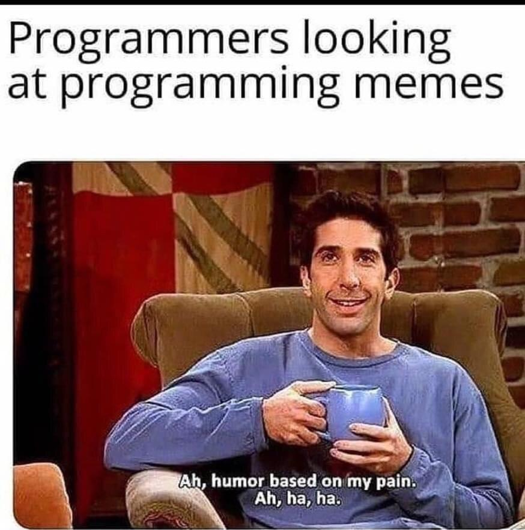

# Oppgaver seminar 6

1. Velg ut en land-runde fra ESS, og og lag et nytt datasett med noen variabler du
  synes er interesante 
  
2. Få en oversikt over variablene dine, og se om de er slik du ønsker. Prøv å gjøre om en til
  en dikotom variabel, og skifte navn på noen av variablene, i tillegg til annet du skulle føle
  er nødvendig. 
  
3. Finn en variabel, og utfør noe univariat statistikk. Se om du kan få det både presentert i tall, og
   gjennom grafer. 
   
4. Finn to variabler du mener kan ha en sammenheng. Gjør en korrelasjonstest, og en grafisk presentasjon av
   den eventuelle sammenhengen. 
   
5. Lag minst tre regresjoner. Start med kun de to variablene du ønsker å undersøke, og så legg til kontrollvariabler
   en og en. Presentert disse modellene sammen, og tolk resultatet. 
   
6. Undersøk om restleddene er normalfordelte for de (minst) tre modellene. 

