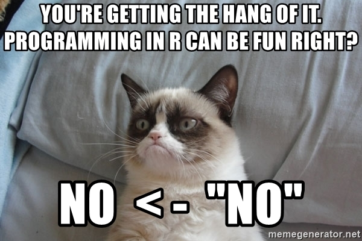

* Oppgave 1: Last inn data, enten fra nettsiden eller fra din egen pc om du lagret dem der. 

* Hent ut flere runder fra samme land
    * Flere land har ikke deltatt i alle rundene. Sjekk at landet du valget
      har vært med i alle de rundene du valgte. 
      Hint: Kanskje table og unique kan hjelpe deg?
      
* Noen av variablene kan gi mening å sammenligne over tid. Velg ut noen du synes er passende. 
  * Bruk et passende plott for å se utviklingen mellom rundene. 
  * Kan du finne noen mål på sentraltendens pr runde? For eksempel gjennomsnitt, median, e.l.?
  
* Kjønn og stemt er dikotome variabler, men med verdiene 1 og 2. 
  * Gjør om verdiene så de har 0 og 1 istedet, og gi variablene nye navn. 
  * Finn ut hvorvidt menn eller kvinner har størtst valgdeltagelse, finn
    et passende plott for dette i tillegg. 

* Prøv å sammenligne stemmegivning pr. kjønn over tid, og mellom land. 

* Flere av variablene måler forskjellige typer tilitt. Ofte sier vi at disse til sammen kan måle det vi kaller
  en "latent" variabel; noe vi ikke kan måle direkte, men hvor flere variabler måler begrepet sammen. Her kan vi
  si at dette er en form for generell "tilit." Prøv å bruke disse variablene til å lage en ny skala du mener representerer
  dette. 
  * Er det noen sammenheng mellom denne nye skalaen og noen av de andre variablene? Velg ut de du tenker kan være
    logiske å sammenligne. 
  * Velg ut et land, ossen har tilitten utviklet seg over tid?
  * Sammenlign noen land, har noen av de høyere tillitt enn andre?
  
* Velg ut ett land, men alle runder de er med. Lag en variabel som har verdien 1 om de i ett gitt år har høyere tilitt
  enn gjennomsnittet, og to om det er under. 
  * Finn hvilke år de har høyere enn gjennomsnittet. 
