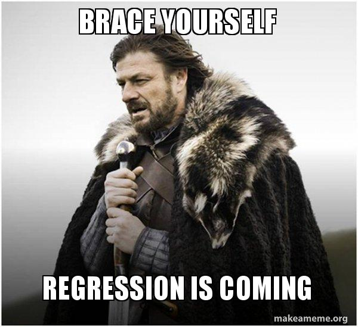
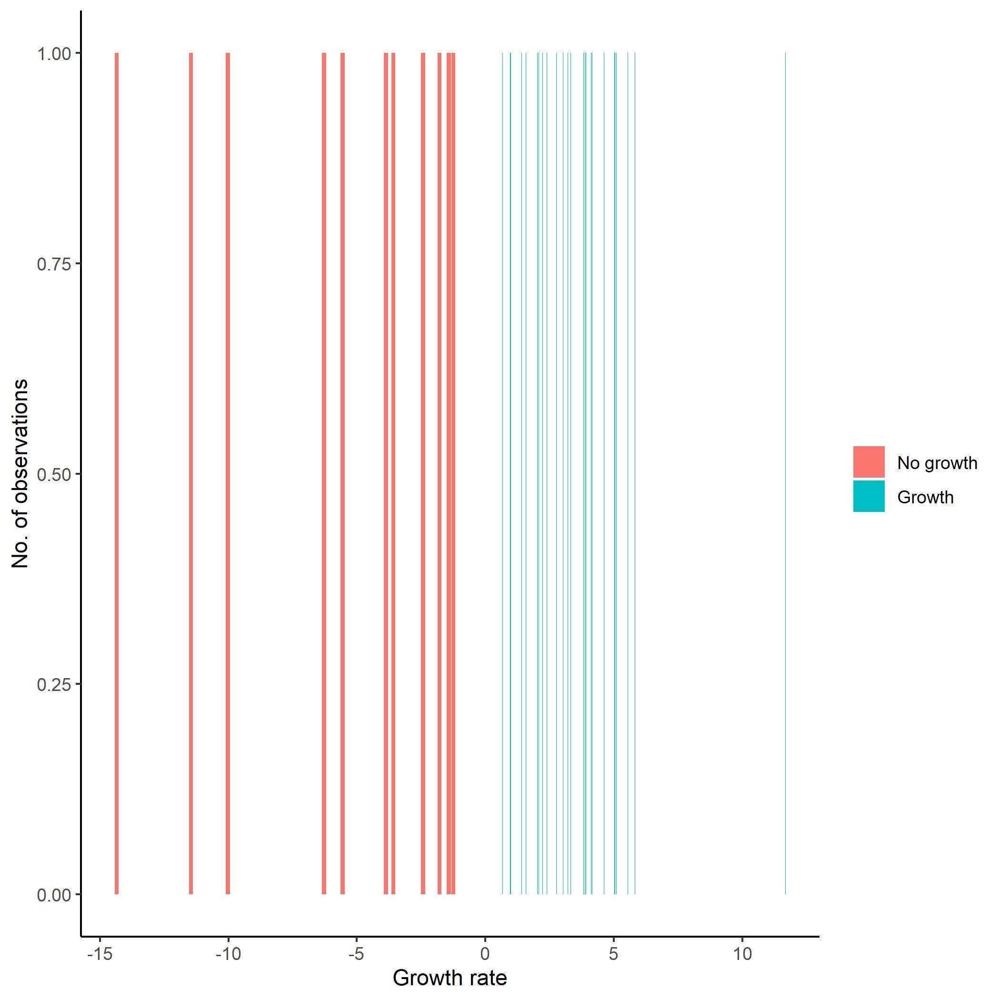
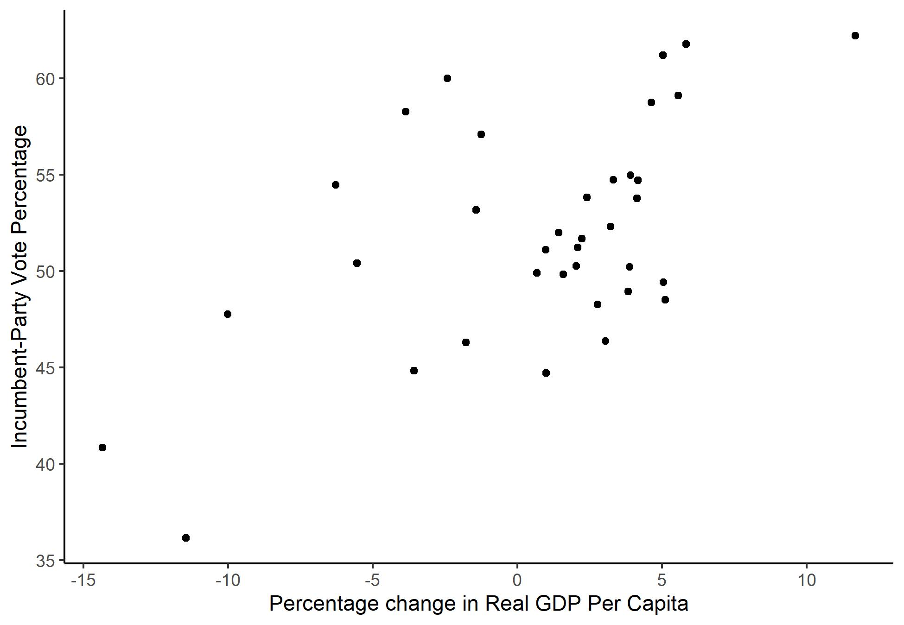
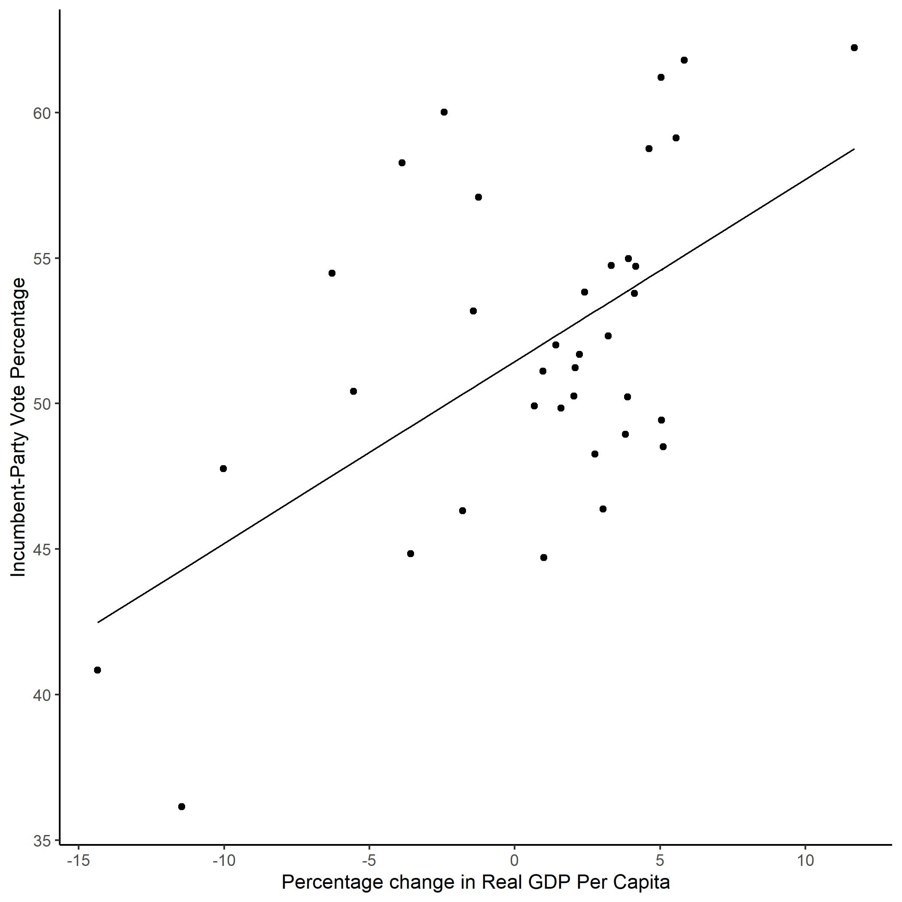

I dag skal vi se på fem ting:

1. Laste inn data (repetisjon)
2. Omkoding av variabler (repetisjon)
3. Plotting (repetisjon)
4. Kjøre en regresjonsmodell med en uavhengig variabel (nytt)
5. Tolkning og fremstilling av regresjonsresultater (nytt)

Datasettet vi skal bruke er det samme som det som omtales i kapittel ni i The
Fundamentals of Political Science Research. I likhet med kapittel ni så skal vi 
kjøre en regresjon der vi ser på effekten av økonomisk vekst (`growth`)
på andel stemmer partiet til den sittende kandidaten får (`inc_vote`). 

```{r, eval = TRUE, include=TRUE, echo=TRUE, message=FALSE}

# Laster inn pakker
library(tidyverse)
library(stargazer)
#En ting vi kan gjøre her er å sette et fast tema for alle plottene våre, da
#trenger vi ikke gjøre det hver gang vi bruker ggplot
theme_set(theme_classic())

EcoData <- read.csv("https://raw.githubusercontent.com/egen97/STV1020_Var_2021/master/ecoData.csv")

```

 

## Undersøker data
Når vi skal kjøre en regresjonsanalyse så er noe av det første vi gjør å undersøke datasettet: 

```{r}
# Hent ut informasjon om variabelnavn, klasse m.m.
str(EcoData)

# Et alternativ til str()
EcoData

# Printer variabelnavnene
names(EcoData)

# Henter ut oppsummerende statistikk:
summary(EcoData)
```

Det er også lurt å sjekke om mange observasjoner har manglende informasjon (missing) på variablene du er interessert i: 

```{r}
# Sjekker hvor mange observasjoner som vi har informasjon på alle variablene om:
table(complete.cases(EcoData))
```

Vi ser at 35 av observasjonene våre ikke har noen missingverdier. Vi kan også sjekke for enkeltvariabler:

```{r}
# Sjekker hvor mange observasjoner som har missing på variabelen inflation
table(is.na(EcoData$inflation))

```

Vi ser at en observasjon har missing på variabelen `inflation`. 

Legg merke til at funksjonene `complete.cases()` og `is.na()` er logiske tester. Disse evaluerer hver observasjon og sjekker om vi har informasjon om alle variabler (`complete.cases()`) og om vi mangler informasjon på variabelen `inflation`. For å illustrere dette så kan vi prøve å legge til to nye variabler i datasettet basert på disse logiske testene: 

```{r}
EcoData <- EcoData %>% 
  mutate(complete = complete.cases(.),
         inf_na = is.na(inflation))
```

Bruk `view()` eller klikk på datasettet ditt for å se hvordan de nye variablene ser ut. Hva betyr `TRUE` og `FALSE` i de to kolonnene?

Mer informasjon om missingverdier finner dere i dokumentet som beskriver seminar 4. 

## Omkoding av variabler
Etter at vi har kartlagt datastrukturen og hvilke variabler vi har så må vi vurdere om noen av variablene må omkodes før vi kan gjøre analysen vår. For å få samme resultater som i kapittel ni trenger vi ikke å omkode noe, men for å få noe å sammenligne med skal vi lage en dikotom variabel. 

I `tidyverse` bruker man som regel `mutate()`sammen med andre funksjoner for å opprette nye variabler. Koden over hvor vi opprettet variabler for de logiske testene `complete.cases()` og `is.na()` er eksempler på dette. Nå skal vi også kombinere `mutate()` med `if.else` for å lage en dikotom variabel som tar verdien `Growth` om observasjonen er et år med positiv økonomisk vekst og `No growth` om observasjonen er et år uten
økonomisk vekst: 

```{r}
# Oppretter den nye variabelen og endrer referansekategori
EcoData <- EcoData %>% 
  mutate(growth_dich = ifelse(growth > 0, "Growth", "No growth"),
         growth_dich = factor(growth_dich, levels = c("No growth", "Growth")))
```

Hvordan `ifelse()` fungerer er nærmere beskrivet i seminar 3. Det neste vi gjør er å sjekke om omkodingen ble riktig: 

```{r}
# Sjekker at det ser ok ut: 
class(EcoData$growth_dich)
table(EcoData$growth_dich, useNA = "always")
```

Når du lager en faktor-variabel så tar R utgangspunkt i alfabetet når referansekategorien bestemmes. I dette tilfellet ville referansekateogrien blitt
"Growth", men vi bruker `factor()` til å endre referansekategorien til "No growth". 

Når en omkoder numeriske variabler så kan det være nyttig å lage et plott for å sjekke at det ble riktig. Her bruker vi `fill` argumentet til å gi ulik farge 
til observasjonene basert på om det var vekst eller ikke: 

```{r, eval = FALSE}
ggplot(data = EcoData) +
  geom_bar(aes(x=growth, fill = growth_dich),
               binwidth = 1) +
  theme(legend.title=element_blank()) +
  xlab("Growth rate") +
  ylab("No. of observations")
ggsave("Bilder/growth.jpg") #Med ggsave kan jeg lagre plottet, så jeg f.eks. kan putte det i en word-fil

```



Ut fra plottet kan vi se at alle observasjonene med verdien `No growth` hadde negativ vekstrate, mens alle observasjoner med verdien `Growth` hadde positiv vekstrate. 

For å lagre plottet lokalt på pc-en så kan bruker export og save as under Plots.

## Litt plotting før regresjon
Før du kjører en regresjon så kan det være lurt å plotte den avhengige og den uavhengige variabelen din. I vårt tilfelle er dette variabelene `inc_vote` og `growth`. For å få til dette bruker vi `ggplot`.

```{r}
ggplot(data = EcoData) +
  geom_point(aes(x = growth, y = inc_vote)) +
  ylab("Incumbent-Party Vote Percentage") +
  xlab("Percentage change in Real GDP Per Capita") 

ggsave("RegPlotGrInc.jpg")
```



## Regresjon med numerisk uavhengig variabel


For å kjøre en lineær regresjon i R så bruker vi funksjonen `lm()`.  `lm()` har følgende syntaks: 

```{r, eval = FALSE}
lm(avhengig_variabel ~ uavhengig_variabel, data = mitt_datasett)
# På mac får du ~ med alt + k + space
```

Dersom datasettet ditt har manglende informasjon (missing/NA) så må du legge til et element som sier hvordan regresjonen skal forholde seg til dette. Ved å legge til `na.action = "na.exclude"` i `lm()` så beholder R informasjon om hvilke 
observasjoner som mangler data slik at vi kan bruke `fitted()` som vi skal snakke mer om senere. 

I eksempelet fra kapittel ni i Kellsted og Whitten er vi interessert i effekten av den uavengige variabelen `growth` på den avhengige variabelen `inc_vote`. Under kjører vi modellen og lagrer den som `model` i Environment:

```{r}
model <- lm(inc_vote ~ growth, 
            data = EcoData,
            na.action = "na.exclude")

```

Det finnes flere måter å undersøke resultatene på. Vi skal se på hvordan vi kan gjøre dette ved hjelp av `summary()`, `stargazer()` og `ggplot()`. Vi skal først se på `summary()`.

```{r}
summary(model)
```

`stargazer()` er en nyttig funksjon som gir oss samme informasjon som `summary()`, men i et litt mer lettlest format. 

```{r}
stargazer(model, 
          type = "text")
```

Ved hjelp av stargazer så kan vi også lagre tabeller lokalt på PC-en som vi kan bruke i word-dokumenter og liknende. Da endrer vi på `type` argumentet og legger
til et `out` argument. `out` argumentet forteller i hvilken mappe du vil lagre filen samt hva filen skal hete. Da får du en .htm-fil som ser omtrent ut som i
eksempelet under. Den kan du høyreklikke på og velge åpne i word dersom du skal ha tabellen inn i en oppgave eller liknende: 

```{r, message=FALSE, eval=FALSE}
stargazer(model,  
          type = "html",
          out = "model1_tab.htm")
```

Informasjonen vi får ved hjelp av `summary()` og `stargazer()` er veldig nyttig.Vi får vite koeffisientene, standardfeilene og informasjon vi kan bruke til å evaluere modellen vår. I seminar skal vi bruke en del tid på å tolke disse tabellene.

Et alternativ til tabeller er å plotte resultatene fra regresjonen. Nå skal vi lage figur 9.4 i kapittel ni ved hjelp av `ggplot()`. 

Først lager vi et plott med de observerte verdiene (dette er det samme plottet som vi lagde tidligere): 
```{r}
ggplot(data = EcoData) +
  geom_point(aes(x = growth, y = inc_vote)) +
  theme_bw() +
  ylab("Incumbent-Party Vote Percentage") +
  xlab("Percentage change in Real GDP Per Capita") 


```


Det neste vi skal gjøre er å legge til regresjonslinjen i plottet. Dette kan gjøres på to måter. 

### Legge til regresjonslinje med `geom_smooth`

Den første måten er å bruke `geom_smooth(method = "lm")` for å plotte en regresjonslinje:

```{r, eval=FALSE}
ggplot(data = EcoData) +
  geom_point(aes(x = growth, y = inc_vote)) +
  ylab("Incumbent-Party Vote Percentage") +
  xlab("Percentage change in Real GDP Per Capita") +
  geom_smooth(aes(x = growth, y = inc_vote),
              method = "lm", color = "goldenrod3")

ggsave("GRlin.jpg")
```


I kapittel ni viser Kellstedt og  Whitten at regresjonslinjen krysser
utvalgets gjennomsnittsverdier på uavhengig og avhengig variabel. Det kan vi også
vise ved å legge til to linjer i koden vår:

```{r, eval=FALSE}
ggplot(data = EcoData) +
  geom_point(aes(x = growth, y = inc_vote)) +
  ylab("Incumbent-Party Vote Percentage") +
  xlab("Percentage change in Real GDP Per Capita") +
  geom_smooth(aes(x = growth, y = inc_vote),
              method = "lm", color = "goldenrod3") +
  geom_hline(yintercept=mean(EcoData$inc_vote), linetype = "dashed") +
  geom_vline(xintercept=mean(EcoData$growth), linetype = "dashed")

ggsave("Bilder/meansreg.jpg")
```


### Legge til regresjonslinje med `fitted()` og `geom_line()`
Den andre metoden er å be R løse regresjonslikningen for alle observasjonene våre og så legge til et nytt lag med predikerte verdier i plottet. Denne metoden går vi ikke gjennom i detalj på seminar så det holder i massevis å kunne den første. 

R kan regne ut de predikerte verdiene for oss ved hjelp av funksjonen `fitted()` så vi slipper heldigvis å gjøre det for hånd. 

Her bruker vi funksjonene `fitted()` og `resid()` til å legge til predikerte verdier og residualer for de ulike variablene i datasettet vårt:
```{r}
EcoData <- EcoData %>% 
  mutate(fitted = fitted(model), 
         residuals = resid(model))
```

Nå kan vi bruke denne informasjonen til å legge til en regresjonslinje i plottet vårt. Prikkene angir de ulike *observerte* verdikominasjonene, mens den rette
linjen gir oss den lineære sammenhengen fra modellen vår. 

```{r, eval=FALSE}
ggplot(data = EcoData) +
  geom_point(aes(x = growth, y = inc_vote)) +
  ylab("Incumbent-Party Vote Percentage") +
  xlab("Percentage change in Real GDP Per Capita") +
  geom_line(aes(x = growth, y = fitted))

ggsave("Bilder/FittedValues.jpg")
```



Også her kan vi vise at regresjonslinjen krysser utvalgets gjennomsnittsverdier på uavhengig og avhengig variabel. Vi legger til de to linjene `geom_hline()` og `geom_vline()`:

```{r, eval=FALSE}
ggplot(data = EcoData) +
  geom_point(aes(x = growth, y = inc_vote)) +
  ylab("Incumbent-Party Vote Percentage") +
  xlab("Percentage change in Real GDP Per Capita") +
  geom_line(aes(x = growth, y = fitted)) +
  geom_hline(yintercept=mean(EcoData$inc_vote), linetype = "dashed") +
  geom_vline(xintercept=mean(EcoData$growth), linetype = "dashed")

ggsave("FittedMean.jpg")

```


I kapittel ni i Kellstedt og Whitten er det flere eksempler på hvordan vi kan sjekke om en modell er god eller ikke. Noe av det gikk vi gjennom når vi så på resultatene av modellen. En ting som ikke kommer med når vi bruker `stargazer()` og `summary()` er 
konfidensintervallene til en koeffisient. De kan vi enkelt hente ut ved hjelp av
funksjonen `confint()`: 

```{r}
confint(model)
```

## Regresjon med dikotom uavhengig variabel
For å øve oss på tolkning skal vi nå kjøre en modell med `inc_vote` som avhengig 
variabel og den dikotome vekst-variabelen vi lagde tidligere som uavhengig variabel. At en variabel er dikotom betyr at den bare har to verdier.  Først kjører vi modellen før vi undersøker resultatene i stargazer:

```{r}
# Lagrer modellen
model_dich <- lm(inc_vote ~ growth_dich, 
                 data = EcoData,
                 na.action = "na.exclude")

# Undersøker resultatene
stargazer(model_dich, 
          type = "text")
```