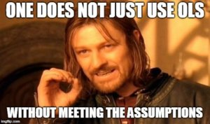

Velkommen til siste seminar! Etter 5 seminarganger har vi gått igjennom og lært mye, og nå er vi på den store avslutningen! Det siste vi skal gå igjennom er hvordan vi kan teste ut regresjonene våre fra forrige gang, og se på regresjoner med flere variabler. Etter det vi gjorde forrige gang er det heldigvis ganske lette oppgaver. Dette gjør jo at vi har god tid til å gå igjennom det vi har lært, så her blir det en god mulighet til å se på det vi har lært så langt! La oss derfor begynne med en kjapp gjennomgang i hva vi har sett på i de 5 siste seminarene, og hva vi burde ha fått ut av det. 

# Seminargjennomgang 

1. Seminar
  + RStudio: Hva programmet er, hvordan det ser ut, og hvordan det fungerer
  + Objekter: Vektorer, og data.frames
  + Funksjoner: mattematiske 
2. Seminar
  + Pakker: Tidyverse, m.m.
  + Laste inn data, og lagre data
  + logiske verdier og tester
  + Hente ut spesifikke datapuntker: filter() og select()
  + plotting
3. Seminar: Repetisjon 

4. Seminar 
  + Kode om og skape ny variabler
  + factor-variabler
  + Analysere missing verdier
  + Univariat statistikk: varians, standardavik, etc. 
  + Bivariat analyse: frekvenstabeller, kjikvadrat, korrelasjon, scatter-plot
  + Plotte bivariat sammenheng

5. Seminar
  + Bekrefte omkoding med grafikk
  + avansert grafikk
  + regresjon


# Seminar 6

 Som alltid begynner vi med å laste inn pakker, og data. I dag skal vi tilbake til det datasettet vi begynte med i starten, med data fra the European Social Survey! 


```{r, message=FALSE}
library(tidyverse)
library(stargazer)
ESS <- read.csv("https://raw.githubusercontent.com/egen97/4020A_RSeminar/master/ESS_Selected.csv")

```

Fra før har vi sett på flere forskjellige måter vi kan undersøke dataene våre. Fra før har vi her brukt head(), str(), summary() og tail()

```{r}
head(ESS)
tail(ESS)
str(ESS)
summary(ESS)
```

Dette datasettet, som vi husker, krever at vi henter ut en land-runde for å kunne bruke dataene. For å gjøre dette har vi brukt logiske tester for å filtrere ut land og runder. 

```{r}
#Først må vi finne ut hvilke land og runder vi har. For å gjøre dette har vi brukt unique() funksjonen

unique(ESS$Country)
unique(ESS$essround)

#Disse to viser sammen hvilke land og runder vi har, men samtidig vil vi vite hvilke land som er med i hvilke runder
#For å kunne gjøre dette kan vi lage en tabell

table(ESS$Country, ESS$essround)
#Her ser vi hvor mange respondenter et land har i hver runde. 
#Har de 0 er de logisk nok ikke med i runden
```

Som vi kan se er er f.eks. Estland med i runde 6, framover kan vi bruke dette for å gjøre resten av analysen vår. 

```{r}

#Filter gjør at vi kan hente ut kun de radene i datasettet som tilfredstiller et kritere
#Her henter vi ut de som har ES på land-variabelen, og 6 på rundenivå

ES6 <- ESS %>%
  filter(Country == "ES" & essround == 6)

```

I datasettet er det flere variabler vi kan prøve å finne ut av sammenhengen mellom. Dette ville vi vanligist vist bestemt utifra en hypotese basert på en teori.  Her kan vi se om det er en sammenheng mellom hvor religiøs en person er, og hvovidt de støtter rettigheter for LGBT mennesker. En god start kan være å bare se på variablene, og fordelingen for dem. Etter det kan vi prøve å lage et scatter-plot for å se om vi kan finne noen visuell sammenheng. 

```{r}

ggplot(ES6, aes(Religous)) +
  geom_density() +
  theme_classic()

# Fra det første plottet ser vi at variabelen har de fleste noe over 5 på sakalen over hvor religiøse det er, en del
# er også på 9, men ganske få mellom 1-5. 

ggplot(ES6, aes(LGBT_Free)) +
  geom_density()+
  theme_classic()

```

Her kan vi se at verdiene er ganske spredd, men med de fleste på verdien 1 og en del rundt 2. Fra 3 og oppover går antallet som har verdien ganske kraftig nedover. Alså kan vi se at det er generelt ganske lav støtte for LGBT-rettigheter i dette landet på den runden. 

## Kontrollvariabler


Når vi skal kjøre regresjonen vår er det så klart flere andre variabler som kan påvirke hvorvidt et gitt individ støtter LGBT-rettigheter eller ikke. Ting som kjønn, alder, og inntekt, og politisk ståsted er ganske logiske variabler å undersøke her. Før vi kan bruke disse bør vi undersøke hvordan de ser ut, og hvorvidt formatet passer til regresjonen eller ikke. 

```{r}
summary(ES6$Age) #Dette er en ren numerisk skala, så den er jo perfekt
summary(ES6$Income) #Her kan vi se at inntekt ikke er målt i absolutte tall, men en 1:10 skala.
                    #hadde vi hatt tilgang til de faktiske tallene hadde det vært noe bedre, men skalaen utgjør ikke et stort problem. 

summary(ES6$Gender)
#Her kan vi se at skalaen er på 1 og 2. I dikotome variabler er det for tolkningens del som oftest enklere
#å bruke 0 og 1, så denne vil vi gjerne få gjort om. Denne er jo ganske lett, siden vi bare må trekke fra
# 1 på verdiene
summary(ES6$Left_Right) #Denne er målt på en skala fra 1:0 fra venstre til høyre

ES6$kjonn <- ES6$Gender - 1


```


Nå har vi gått igjennom variablene våre. Likevell, er det noe vi kan se at mangler her? Noe vi ikke har gjort så langt er å undersøke om vi har forstått variablene er korrekt. Derfor kan det alltid være lurt å lese [kodeboken](https://github.com/egen97/STV1020_Var_2021/blob/master/Kodebok.md) før vi begynner analysen. Noe vi ser ganske fort er at på LGBT-free variabelen vår er høyere tall *mindre støtte*, og 1 tilsvarer de som er *helt enige* i spørsmålet om de støtter lgbt-rettigheter. Altså er analysen vi fikk ut av grafen feil, og dette hadde jo gitt oss en helt feil tolkning av regresjonen vår! Det er ofte lettere å tolke at en høyere verdi henger sammen med et høyere nivå av det variabelen måler, la oss derfor forsøke å snu skalaen slik at høyere støtte også blir et høyere tall. 


```{r}

#Når vi ønsker å snu verdier på denne måten er det som oftest lettest å bruke funksjonen recode()
unique(ES6$LGBT_Free) #Først kan vi bruke unique() for å se hvilke verdier vi har i variabelen

 ES6$lgbt_recode <- recode(ES6$LGBT_Free,
    "1" = "5",
    "2" = "4", 
    "3" = "3", 
    "4" = "2",
    "5" = "1" 
    )


```

# Regresjoner

Nå har vi endelig de dataene vi trenger for å kjøre modellene våre. Hvordan vi kjører en regresjon hadde vi forrige gang, 
med en standard formel for hvordan å gjøre dem. For å legge til flere er det bare å utvide den vi kjørte sist. 

```{r}
Mod1 <- lm(lgbt_recode ~ Religous + kjonn + Income + Left_Right, ES6, na.action = "na.exclude")
#For å kjapt undersøke modellen kan vi bruke summary()
summary(Mod1)
```

Første vi kan se her er at religion ser ut til å ha en ganske svak, men signifikant negativ effekt. Samme kan vi forøvrig finne av
av å være mer på høyresiden, og denne er jo noe kraftigere. De som er på høyresiden er jo ofte noe mer religiøse, så her kan det kanskje finnes en samspill effekt? Å legge til et samspillsledd gjør at vi kan se både effekten hver av de to variablene har alene, men også hvorvidt de har en effekt sammen. 

```{r}
Mod2 <- lm(lgbt_recode ~ Religous * Left_Right + kjonn + Income , ES6, na.action = "na.exclude")
#For å legge til et samspillsledd tar vi å legger ett gangettegn ( * ) mellom variablene heller enn et plusstegn
```

Siden vi nå vil sammenligne modellene er det ofte lettere å lage en felles tabell med stargazer

```{r, message=FALSE, warning=FALSE}
stargazer(Mod1, Mod2, type = "text",  covariate.labels = c(
  "Religion", "Kjønn", "Inntekt", "Samspill(Religion/Ideologi)", "Ideologi"),
  title = "Støtte til LGBT rettigheter", dep.var.caption = "LGBT-rettigheter"
)
```

Hva har forandret seg her? Her har dere en god sjanse til å se hvordan dere tolker en model!


# Forutsetninger for OLS




OLS har flere forutsetninger vi må oppfylle for å kunne si at OLS er BLUE, og vi dermed kan stole på modellen vår. Forrige gang så vi f.eks. hvordan vi kan hente ut restleddene for å undersøke at disse er normalfordelte. 

```{r, }

#For å hente ut restleddene våre bruker vi funksjonen resid()

ES6$resmod1 <- resid(Mod1)
ES6$resmod2 <- resid(Mod2)

#Disse kan vi så plotte med f.eks. et density-plot

ggplot(ES6) +
  geom_density(aes(resmod1), fill = "paleturquoise1") +
  geom_density(aes(resmod2), fill = "firebrick2", alpha = .5) +
  theme_classic() +
  labs(y = "", x = "Restledd")

ggsave("Bilder/resplo.jpg")

#Her har vi lagt plottene våre oppå hverandre, og det vi kan se er jo at de er nesten helt like. 
#Begge er noe venstreskjeve, med en lang hale. Hvorvidt vi mener dette
#bryter med forutsetningene eller ikke blir et tolkningsspørsmål som du må
#ta stilling til. 


```


```{r}
#En annen sjekk funksjon i R er at vi kan teste ut en del forutsetninger bare ved
#å bruke plot() funksjonen

plot(Mod1)
plot(Mod2)
```


