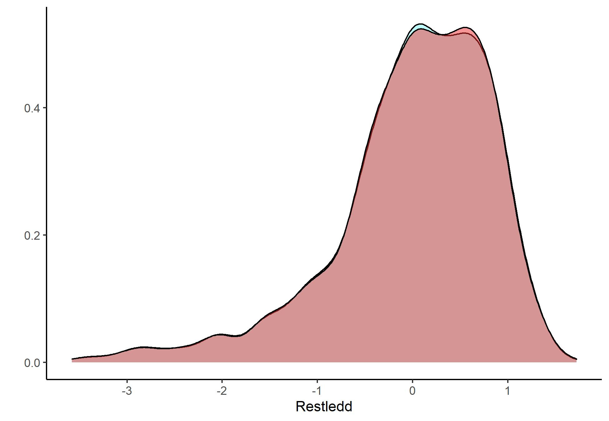

Velkommen til siste seminar! Etter 5 seminarganger har vi gått igjennom og lært mye, og nå er vi på den store avslutningen! Det siste vi skal gå igjennom er hvordan vi kan teste ut regresjonene våre fra forrige gang, og se på regresjoner med flere variabler. Etter det vi gjorde forrige gang er det heldigvis ganske lette oppgaver. Dette gjør jo at vi har god tid til å gå igjennom det vi har lært, så her blir det en god mulighet til å se på det vi har lært så langt! La oss derfor begynne med en kjapp gjennomgang i hva vi har sett på i de 5 siste seminarene, og hva vi burde ha fått ut av det. 

# Seminargjennomgang 

1. Seminar
  + RStudio: Hva programmet er, hvordan det ser ut, og hvordan det fungerer
  + Objekter: Vektorer, og data.frames
  + Funksjoner: mattematiske 
2. Seminar
  + Pakker: Tidyverse, m.m.
  + Laste inn data, og lagre data
  + logiske verdier og tester
  + Hente ut spesifikke datapuntker: filter() og select()
  + plotting
3. Seminar: Repetisjon 

4. Seminar 
  + Kode om og skape ny variabler
  + factor-variabler
  + Analysere missing verdier
  + Univariat statistikk: varians, standardavik, etc. 
  + Bivariat analyse: frekvenstabeller, kjikvadrat, korrelasjon, scatter-plot
  + Plotte bivariat sammenheng

5. Seminar
  + Bekrefte omkoding med grafikk
  + avansert grafikk
  + regresjon


# Seminar 6

 Som alltid begynner vi med å laste inn pakker, og data. I dag skal vi tilbake til det datasettet vi begynte med i starten, med data fra the European Social Survey! 


```r
library(tidyverse)
library(stargazer)
ESS <- read.csv("https://raw.githubusercontent.com/egen97/4020A_RSeminar/master/ESS_Selected.csv")
```

Fra før har vi sett på flere forskjellige måter vi kan undersøke dataene våre. Fra før har vi her brukt head(), str(), summary() og tail()


```r
head(ESS)
```

```
##   Time_News Trust_People People_Fair Pol_Interest Trust_Police
## 1        NA            7           7            3           10
## 2        NA            6           3            1            5
## 3        NA            0           3            2            8
## 4        NA            8           5            2            9
## 5        NA            8           8            3            4
## 6        NA            0           5            1            6
##   Trust_Politicians vote Party_Voted_NO Left_Right Satisfied_Gov
## 1                 0    2             NA          6             7
## 2                 0    1             NA          6             0
## 3                 2    1             NA          5             7
## 4                 4    1             NA          5             3
## 5                 4    1             NA          5             5
## 6                 0    2             NA         NA             0
##   Gov_Reduce_IncomDif LGBT_Free Religous Climate_Human Responsibility_Climate
## 1                   2         1        8            NA                     NA
## 2                   1         1        5            NA                     NA
## 3                   2         1        7            NA                     NA
## 4                   4         3        7            NA                     NA
## 5                   4         2       10            NA                     NA
## 6                   1         1        3            NA                     NA
##   Goverment_Climate Basic_Income Important_Rules Important_Equal_Oppurtunities
## 1                NA           NA               1                             1
## 2                NA           NA               6                             1
## 3                NA           NA               2                             2
## 4                NA           NA               3                             2
## 5                NA           NA               6                             1
## 6                NA           NA               5                             1
##   Income Gender Age Country essround
## 1     NA      1  54      AT        1
## 2     NA      1  50      AT        1
## 3     NA      2  63      AT        1
## 4     NA      1  44      AT        1
## 5     NA      2  41      AT        1
## 6     NA      2  63      AT        1
```

```r
tail(ESS)
```

```
##        Time_News Trust_People People_Fair Pol_Interest Trust_Police
## 434060        76            1           1            4            2
## 434061        60            0           2            2            0
## 434062        20            1           2            2            4
## 434063       120            7           9            3            7
## 434064        60            5           5            2            9
## 434065        60            7           7            1            9
##        Trust_Politicians vote Party_Voted_NO Left_Right Satisfied_Gov
## 434060                 0    2             NA          5             4
## 434061                 0    2             NA         10             0
## 434062                 7    1             NA          9             3
## 434063                 3    1             NA          5             5
## 434064                 5    1             NA          3             5
## 434065                 8    1             NA          5             7
##        Gov_Reduce_IncomDif LGBT_Free Religous Climate_Human
## 434060                   2        NA        7            NA
## 434061                   1         2        8            NA
## 434062                   1         5        7            NA
## 434063                   1         2        5            NA
## 434064                   2         4        7            NA
## 434065                   1         4        9            NA
##        Responsibility_Climate Goverment_Climate Basic_Income Important_Rules
## 434060                     NA                NA           NA               2
## 434061                     NA                NA           NA               3
## 434062                     NA                NA           NA               3
## 434063                     NA                NA           NA               3
## 434064                     NA                NA           NA               3
## 434065                     NA                NA           NA               1
##        Important_Equal_Oppurtunities Income Gender Age Country essround
## 434060                             2      2      2  77      SK        9
## 434061                             2      5      2  63      SK        9
## 434062                             3      1      1  59      SK        9
## 434063                             3     NA      2  66      SK        9
## 434064                             2      1      2  65      SK        9
## 434065                             2     NA      1  23      SK        9
```

```r
str(ESS)
```

```
## 'data.frame':	434065 obs. of  24 variables:
##  $ Time_News                    : int  NA NA NA NA NA NA NA NA NA NA ...
##  $ Trust_People                 : int  7 6 0 8 8 0 5 6 7 4 ...
##  $ People_Fair                  : int  7 3 3 5 8 5 9 7 8 3 ...
##  $ Pol_Interest                 : int  3 1 2 2 3 1 3 2 3 3 ...
##  $ Trust_Police                 : int  10 5 8 9 4 6 6 7 8 5 ...
##  $ Trust_Politicians            : int  0 0 2 4 4 0 5 4 3 5 ...
##  $ vote                         : int  2 1 1 1 1 2 1 1 1 1 ...
##  $ Party_Voted_NO               : int  NA NA NA NA NA NA NA NA NA NA ...
##  $ Left_Right                   : int  6 6 5 5 5 NA NA 6 5 5 ...
##  $ Satisfied_Gov                : int  7 0 7 3 5 0 5 5 3 5 ...
##  $ Gov_Reduce_IncomDif          : int  2 1 2 4 4 1 NA 4 4 1 ...
##  $ LGBT_Free                    : int  1 1 1 3 2 1 NA 2 1 1 ...
##  $ Religous                     : int  8 5 7 7 10 3 8 1 6 5 ...
##  $ Climate_Human                : int  NA NA NA NA NA NA NA NA NA NA ...
##  $ Responsibility_Climate       : int  NA NA NA NA NA NA NA NA NA NA ...
##  $ Goverment_Climate            : int  NA NA NA NA NA NA NA NA NA NA ...
##  $ Basic_Income                 : int  NA NA NA NA NA NA NA NA NA NA ...
##  $ Important_Rules              : int  1 6 2 3 6 5 4 5 2 1 ...
##  $ Important_Equal_Oppurtunities: int  1 1 2 2 1 1 2 1 2 1 ...
##  $ Income                       : int  NA NA NA NA NA NA NA NA NA NA ...
##  $ Gender                       : int  1 1 2 1 2 2 2 2 1 2 ...
##  $ Age                          : int  54 50 63 44 41 63 75 41 47 52 ...
##  $ Country                      : chr  "AT" "AT" "AT" "AT" ...
##  $ essround                     : int  1 1 1 1 1 1 1 1 1 1 ...
```

```r
summary(ESS)
```

```
##    Time_News       Trust_People     People_Fair      Pol_Interest  
##  Min.   :   0.0   Min.   : 0.000   Min.   : 0.000   Min.   :1.000  
##  1st Qu.:  30.0   1st Qu.: 3.000   1st Qu.: 4.000   1st Qu.:2.000  
##  Median :  60.0   Median : 5.000   Median : 6.000   Median :3.000  
##  Mean   :  85.9   Mean   : 4.959   Mean   : 5.533   Mean   :2.636  
##  3rd Qu.:  90.0   3rd Qu.: 7.000   3rd Qu.: 7.000   3rd Qu.:3.000  
##  Max.   :1440.0   Max.   :10.000   Max.   :10.000   Max.   :4.000  
##  NA's   :343684   NA's   :1672     NA's   :4287     NA's   :1516   
##   Trust_Police    Trust_Politicians      vote       Party_Voted_NO  
##  Min.   : 0.000   Min.   : 0.000    Min.   :1.000   Min.   : 1.0    
##  1st Qu.: 4.000   1st Qu.: 1.000    1st Qu.:1.000   1st Qu.: 3.0    
##  Median : 6.000   Median : 3.000    Median :1.000   Median : 6.0    
##  Mean   : 5.909   Mean   : 3.474    Mean   :1.359   Mean   : 5.3    
##  3rd Qu.: 8.000   3rd Qu.: 5.000    3rd Qu.:2.000   3rd Qu.: 7.0    
##  Max.   :10.000   Max.   :10.000    Max.   :3.000   Max.   :11.0    
##  NA's   :5668     NA's   :9380      NA's   :4407    NA's   :430728  
##    Left_Right    Satisfied_Gov   Gov_Reduce_IncomDif   LGBT_Free    
##  Min.   : 0.00   Min.   : 0.00   Min.   :1.000       Min.   :1.000  
##  1st Qu.: 4.00   1st Qu.: 2.00   1st Qu.:1.000       1st Qu.:1.000  
##  Median : 5.00   Median : 4.00   Median :2.000       Median :2.000  
##  Mean   : 5.13   Mean   : 4.18   Mean   :2.097       Mean   :2.281  
##  3rd Qu.: 7.00   3rd Qu.: 6.00   3rd Qu.:3.000       3rd Qu.:3.000  
##  Max.   :10.00   Max.   :10.00   Max.   :5.000       Max.   :5.000  
##  NA's   :63887   NA's   :16846   NA's   :9053        NA's   :20116  
##     Religous      Climate_Human    Responsibility_Climate Goverment_Climate
##  Min.   : 0.000   Min.   : 1.0     Min.   : 0.0           Min.   : 0.0     
##  1st Qu.: 2.000   1st Qu.: 3.0     1st Qu.: 4.0           1st Qu.: 3.0     
##  Median : 5.000   Median : 3.0     Median : 6.0           Median : 5.0     
##  Mean   : 4.723   Mean   : 3.8     Mean   : 5.6           Mean   : 4.6     
##  3rd Qu.: 7.000   3rd Qu.: 4.0     3rd Qu.: 8.0           3rd Qu.: 6.0     
##  Max.   :10.000   Max.   :55.0     Max.   :10.0           Max.   :10.0     
##  NA's   :4145     NA's   :391831   NA's   :392138         NA's   :392987   
##   Basic_Income    Important_Rules Important_Equal_Oppurtunities
##  Min.   :1.0      Min.   :1.000   Min.   :1.000                
##  1st Qu.:2.0      1st Qu.:2.000   1st Qu.:1.000                
##  Median :3.0      Median :3.000   Median :2.000                
##  Mean   :2.5      Mean   :3.115   Mean   :2.098                
##  3rd Qu.:3.0      3rd Qu.:4.000   3rd Qu.:3.000                
##  Max.   :4.0      Max.   :6.000   Max.   :6.000                
##  NA's   :393473   NA's   :18352   NA's   :16047                
##      Income           Gender           Age           Country         
##  Min.   : 1.00    Min.   :1.000   Min.   : 13.00   Length:434065     
##  1st Qu.: 3.00    1st Qu.:1.000   1st Qu.: 33.00   Class :character  
##  Median : 5.00    Median :2.000   Median : 48.00   Mode  :character  
##  Mean   : 5.17    Mean   :1.539   Mean   : 48.22                     
##  3rd Qu.: 7.00    3rd Qu.:2.000   3rd Qu.: 63.00                     
##  Max.   :10.00    Max.   :2.000   Max.   :123.00                     
##  NA's   :203079   NA's   :335     NA's   :1999                       
##     essround    
##  Min.   :1.000  
##  1st Qu.:3.000  
##  Median :5.000  
##  Mean   :4.975  
##  3rd Qu.:7.000  
##  Max.   :9.000  
## 
```

Dette datasettet, som vi husker, krever at vi henter ut en land-runde for å kunne bruke dataene. For å gjøre dette har vi brukt logiske tester for å filtrere ut land og runder. 


```r
#Først må vi finne ut hvilke land og runder vi har. For å gjøre dette har vi brukt unique() funksjonen

unique(ESS$Country)
```

```
##  [1] "AT" "BE" "CH" "CZ" "DE" "DK" "ES" "FI" "FR" "GB" "GR" "HU" "IE" "IL" "IT"
## [16] "LU" "NL" "NO" "PL" "PT" "SE" "SI" "EE" "IS" "SK" "TR" "UA" "BG" "CY" "LV"
## [31] "RO" "RU" "HR" "LT" "AL" "XK" "ME" "RS"
```

```r
unique(ESS$essround)
```

```
## [1] 1 2 3 4 5 6 7 8 9
```

```r
#Disse to viser sammen hvilke land og runder vi har, men samtidig vil vi vite hvilke land som er med i hvilke runder
#For å kunne gjøre dette kan vi lage en tabell

table(ESS$Country, ESS$essround)
```

```
##     
##         1    2    3    4    5    6    7    8    9
##   AL    0    0    0    0    0 1201    0    0    0
##   AT 2257 2256 2405    0    0    0 1795 2010 2499
##   BE 1899 1778 1798 1760 1704 1869 1769 1766 1767
##   BG    0    0 1400 2230 2434 2260    0    0 2198
##   CH 2040 2141 1804 1819 1506 1493 1532 1525 1542
##   CY    0    0  995 1215 1083 1116    0    0  781
##   CZ 1360 3026    0 2018 2386 2009 2148 2269 2398
##   DE 2919 2870 2916 2751 3031 2958 3045 2852 2358
##   DK 1506 1487 1505 1610 1576 1650 1502    0    0
##   EE    0 1989 1517 1661 1793 2380 2051 2019 1904
##   ES 1729 1663 1876 2576 1885 1889 1925 1958 1668
##   FI 2000 2022 1896 2195 1878 2197 2087 1925 1755
##   FR 1503 1806 1986 2073 1728 1968 1917 2070 2010
##   GB 2052 1897 2394 2352 2422 2286 2264 1959 2204
##   GR 2566 2406    0 2072 2715    0    0    0    0
##   HR    0    0    0 1484 1649    0    0    0 1810
##   HU 1685 1498 1518 1544 1561 2014 1698 1614 1661
##   IE 2046 2286 1800 1764 2576 2628 2390 2757 2216
##   IL 2499    0    0 2490 2294 2508 2562 2557    0
##   IS    0  579    0    0    0  752    0  880    0
##   IT 1207 1529    0    0    0  960    0 2626 2745
##   LT    0    0    0    0 1677 2109 2250 2122 1835
##   LU 1552 1635    0    0    0    0    0    0    0
##   LV    0    0 1960 1980    0    0    0    0  918
##   ME    0    0    0    0    0    0    0    0 1200
##   NL 2364 1881 1889 1778 1829 1845 1919 1681 1673
##   NO 2036 1760 1750 1549 1548 1624 1436 1545 1406
##   PL 2110 1716 1721 1619 1751 1898 1615 1694 1500
##   PT 1511 2052 2222 2367 2150 2151 1265 1270 1055
##   RO    0    0 2139 2146    0    0    0    0    0
##   RS    0    0    0    0    0    0    0    0 2043
##   RU    0    0 2437 2512 2595 2484    0 2430    0
##   SE 1999 1948 1927 1830 1497 1847 1791 1551 1539
##   SI 1519 1442 1476 1286 1403 1257 1224 1307 1318
##   SK    0 1512 1766 1810 1856 1847    0    0 1083
##   TR    0 1856    0 2416    0    0    0    0    0
##   UA    0 2031 2002 1845 1931 2178    0    0    0
##   XK    0    0    0    0    0 1295    0    0    0
```

```r
#Her ser vi hvor mange respondenter et land har i hver runde. 
#Har de 0 er de logisk nok ikke med i runden
```

Som vi kan se er er f.eks. Estland med i runde 6, framover kan vi bruke dette for å gjøre resten av analysen vår. 


```r
#Filter gjør at vi kan hente ut kun de radene i datasettet som tilfredstiller et kritere
#Her henter vi ut de som har ES på land-variabelen, og 6 på rundenivå

ES6 <- ESS %>%
  filter(Country == "ES" & essround == 6)
```

I datasettet er det flere variabler vi kan prøve å finne ut av sammenhengen mellom. Dette ville vi vanligist vist bestemt utifra en hypotese basert på en teori.  Her kan vi se om det er en sammenheng mellom hvor religiøs en person er, og hvovidt de støtter rettigheter for LGBT mennesker. En god start kan være å bare se på variablene, og fordelingen for dem. Etter det kan vi prøve å lage et scatter-plot for å se om vi kan finne noen visuell sammenheng. 


```r
ggplot(ES6, aes(Religous)) +
  geom_density() +
  theme_classic()
```

```
## Warning: Removed 7 rows containing non-finite values (stat_density).
```

<!-- --> 

```r
# Fra det første plottet ser vi at variabelen har de fleste noe over 5 på sakalen over hvor religiøse det er, en del
# er også på 9, men ganske få mellom 1-5. 

ggplot(ES6, aes(LGBT_Free)) +
  geom_density()+
  theme_classic()
```

```
## Warning: Removed 35 rows containing non-finite values (stat_density).
```

<!-- --> 

Her kan vi se at verdiene er ganske spredd, men med de fleste på verdien 1 og en del rundt 2. Fra 3 og oppover går antallet som har verdien ganske kraftig nedover. Alså kan vi se at det er generelt ganske lav støtte for LGBT-rettigheter i dette landet på den runden. 

## Kontrollvariabler


Når vi skal kjøre regresjonen vår er det så klart flere andre variabler som kan påvirke hvorvidt et gitt individ støtter LGBT-rettigheter eller ikke. Ting som kjønn, alder, og inntekt, og politisk ståsted er ganske logiske variabler å undersøke her. Før vi kan bruke disse bør vi undersøke hvordan de ser ut, og hvorvidt formatet passer til regresjonen eller ikke. 


```r
summary(ES6$Age) #Dette er en ren numerisk skala, så den er jo perfekt
```

```
##    Min. 1st Qu.  Median    Mean 3rd Qu.    Max.    NA's 
##   16.00   34.00   46.00   47.61   61.00  103.00       1
```

```r
summary(ES6$Income) #Her kan vi se at inntekt ikke er målt i absolutte tall, men en 1:10 skala.
```

```
##    Min. 1st Qu.  Median    Mean 3rd Qu.    Max.    NA's 
##    1.00    2.00    4.00    4.62    7.00   10.00     312
```

```r
                    #hadde vi hatt tilgang til de faktiske tallene hadde det vært noe bedre, men skalaen utgjør ikke et stort problem. 

summary(ES6$Gender)
```

```
##    Min. 1st Qu.  Median    Mean 3rd Qu.    Max. 
##   1.000   1.000   2.000   1.517   2.000   2.000
```

```r
#Her kan vi se at skalaen er på 1 og 2. I dikotome variabler er det for tolkningens del som oftest enklere
#å bruke 0 og 1, så denne vil vi gjerne få gjort om. Denne er jo ganske lett, siden vi bare må trekke fra
# 1 på verdiene
summary(ES6$Left_Right) #Denne er målt på en skala fra 1:0 fra venstre til høyre
```

```
##    Min. 1st Qu.  Median    Mean 3rd Qu.    Max.    NA's 
##    0.00    3.00    5.00    4.54    6.00   10.00     155
```

```r
ES6$kjonn <- ES6$Gender - 1
```


Nå har vi gått igjennom variablene våre. Likevell, er det noe vi kan se at mangler her? Noe vi ikke har gjort så langt er å undersøke om vi har forstått variablene er korrekt. Derfor kan det alltid være lurt å lese [kodeboken](https://github.com/egen97/STV1020_Var_2021/blob/master/Kodebok.md) før vi begynner analysen. Noe vi ser ganske fort er at på LGBT-free variabelen vår er høyere tall *mindre støtte*, og 1 tilsvarer de som er *helt enige* i spørsmålet om de støtter lgbt-rettigheter. Altså er analysen vi fikk ut av grafen feil, og dette hadde jo gitt oss en helt feil tolkning av regresjonen vår! Det er ofte lettere å tolke at en høyere verdi henger sammen med et høyere nivå av det variabelen måler, la oss derfor forsøke å snu skalaen slik at høyere støtte også blir et høyere tall. 


```r
#Når vi ønsker å snu verdier på denne måten er det som oftest lettest å bruke funksjonen recode()
unique(ES6$LGBT_Free) #Først kan vi bruke unique() for å se hvilke verdier vi har i variabelen
```

```
## [1]  2  1 NA  5  3  4
```

```r
 ES6$lgbt_recode <- recode(ES6$LGBT_Free,
    "1" = "5",
    "2" = "4", 
    "3" = "3", 
    "4" = "2",
    "5" = "1" 
    )
```

# Regresjoner

Nå har vi endelig de dataene vi trenger for å kjøre modellene våre. Hvordan vi kjører en regresjon hadde vi forrige gang, 
med en standard formel for hvordan å gjøre dem. For å legge til flere er det bare å utvide den vi kjørte sist. 


```r
Mod1 <- lm(lgbt_recode ~ Religous + kjonn + Income + Left_Right, ES6, na.action = "na.exclude")
#For å kjapt undersøke modellen kan vi bruke summary()
summary(Mod1)
```

```
## 
## Call:
## lm(formula = lgbt_recode ~ Religous + kjonn + Income + Left_Right, 
##     data = ES6, na.action = "na.exclude")
## 
## Residuals:
##     Min      1Q  Median      3Q     Max 
## -3.5790 -0.3831  0.1062  0.6161  1.6838 
## 
## Coefficients:
##              Estimate Std. Error t value Pr(>|t|)    
## (Intercept)  4.404594   0.065856  66.883  < 2e-16 ***
## Religous    -0.057093   0.007732  -7.384 2.58e-13 ***
## kjonn        0.156034   0.044376   3.516 0.000451 ***
## Income       0.058143   0.007647   7.603 5.14e-14 ***
## Left_Right  -0.063379   0.009592  -6.607 5.47e-11 ***
## ---
## Signif. codes:  0 '***' 0.001 '**' 0.01 '*' 0.05 '.' 0.1 ' ' 1
## 
## Residual standard error: 0.8403 on 1458 degrees of freedom
##   (426 observations deleted due to missingness)
## Multiple R-squared:  0.132,	Adjusted R-squared:  0.1297 
## F-statistic: 55.45 on 4 and 1458 DF,  p-value: < 2.2e-16
```

Første vi kan se her er at religion ser ut til å ha en ganske svak, men signifikant negativ effekt. Samme kan vi forøvrig finne av
av å være mer på høyresiden, og denne er jo noe kraftigere. De som er på høyresiden er jo ofte noe mer religiøse, så her kan det kanskje finnes en samspill effekt? Å legge til et samspillsledd gjør at vi kan se både effekten hver av de to variablene har alene, men også hvorvidt de har en effekt sammen. 


```r
Mod2 <- lm(lgbt_recode ~ Religous * Left_Right + kjonn + Income , ES6, na.action = "na.exclude")
#For å legge til et samspillsledd tar vi å legger ett gangettegn ( * ) mellom variablene heller enn et plusstegn
```

Siden vi nå vil sammenligne modellene er det ofte lettere å lage en felles tabell med stargazer


```r
stargazer(Mod1, Mod2, type = "text",  covariate.labels = c(
  "Religion", "Kjønn", "Inntekt", "Samspill(Religion/Ideologi)", "Ideologi"),
  title = "Støtte til LGBT rettigheter", dep.var.caption = "LGBT-rettigheter"
)
```

```
## 
## Støtte til LGBT rettigheter
## =============================================================================
##                                             LGBT-rettigheter                 
##                             -------------------------------------------------
##                                                lgbt_recode                   
##                                       (1)                      (2)           
## -----------------------------------------------------------------------------
## Religion                           -0.057***                -0.051***        
##                                     (0.008)                  (0.015)         
##                                                                              
## Kjønn                               0.156***                 0.157***        
##                                     (0.044)                  (0.044)         
##                                                                              
## Inntekt                             0.058***                 0.058***        
##                                     (0.008)                  (0.008)         
##                                                                              
## Samspill(Religion/Ideologi)                                   -0.001         
##                                                              (0.003)         
##                                                                              
## Ideologi                           -0.063***                -0.057***        
##                                     (0.010)                  (0.016)         
##                                                                              
## Constant                            4.405***                 4.380***        
##                                     (0.066)                  (0.084)         
##                                                                              
## -----------------------------------------------------------------------------
## Observations                         1,463                    1,463          
## R2                                   0.132                    0.132          
## Adjusted R2                          0.130                    0.129          
## Residual Std. Error            0.840 (df = 1458)        0.841 (df = 1457)    
## F Statistic                 55.452*** (df = 4; 1458) 44.383*** (df = 5; 1457)
## =============================================================================
## Note:                                             *p<0.1; **p<0.05; ***p<0.01
```

Hva har forandret seg her? Her har dere en god sjanse til å se hvordan dere tolker en model!


# Forutsetninger for OLS


OLS har flere forutsetninger vi må oppfylle for å kunne si at OLS er BLUE, og vi dermed kan stole på modellen vår. Forrige gang så vi f.eks. hvordan vi kan hente ut restleddene for å undersøke at disse er normalfordelte. 


```r
#For å hente ut restleddene våre bruker vi funksjonen resid()

ES6$resmod1 <- resid(Mod1)
ES6$resmod2 <- resid(Mod2)

#Disse kan vi så plotte med f.eks. et density-plot

ggplot(ES6) +
  geom_density(aes(resmod1), fill = "paleturquoise1") +
  geom_density(aes(resmod2), fill = "firebrick2", alpha = .5) +
  theme_classic() +
  labs(y = "", x = "Restledd")
```

```
## Warning: Removed 426 rows containing non-finite values (stat_density).

## Warning: Removed 426 rows containing non-finite values (stat_density).
```

<!-- --> 

```r
ggsave("Bilder/resplo.jpg")
```

```
## Saving 6.5 x 4.5 in image
```

```
## Warning: Removed 426 rows containing non-finite values (stat_density).

## Warning: Removed 426 rows containing non-finite values (stat_density).
```

```r
#Her har vi lagt plottene våre oppå hverandre, og det vi kan se er jo at de er nesten helt like. 
#Begge er noe venstreskjeve, med en lang hale. Hvorvidt vi mener dette
#bryter med forutsetningene eller ikke blir et tolkningsspørsmål som du må
#ta stilling til. 
```



```r
#En annen sjekk funksjon i R er at vi kan teste ut en del forutsetninger bare ved
#å bruke plot() funksjonen

plot(Mod1)
```

<!-- --> <!-- --> <!-- --> <!-- --> 

```r
plot(Mod2)
```

<!-- --> <!-- --> <!-- --> <!-- --> 


