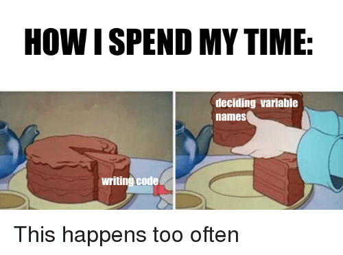
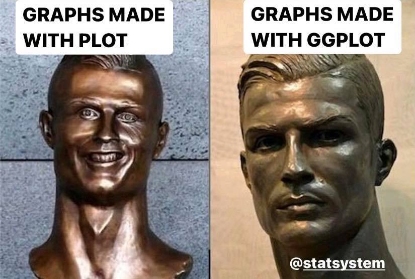

```{r setup, include=FALSE}
knitr::opts_chunk$set(echo = TRUE)
```

# Andre seminar, andre ting å lære!

I dag skal vi lære hvordan å bruke logiske tester, og å få data inn i det formatet vi ønsker. Fra forrige gang kan dere huske at vi lagde våre egne datasett. Som oftest er det jo ikke sånn at vi samler inn data selv, men vi får det fra noen andre. I min master f.eks. bruker jeg data fra World Value Survey. Siden de ikke blir laget på den måten jeg ønsker å bruke dem må jeg bruke en del på forandre formen på dataene. Når vi jobber med statistikk er det som oftest denne delen som faktisk tar tid. Å drive med analyse, kjøre regresjonsmodeller, sjekke modellene våre osv. går ganske fort når dataene er riktige. 


Det finnes ganske mange måter å gjøre "data-wrangling" (det fine ordet på å forandre data, google-tip) på. Et stort skille går på om du gjøre det i base-R eller med en pakke. Det finnes ganske mange pakker der ute som eksisterer for å gjøre dette enklere, men i dette seminaret vil vi fokusere på det som kalles tydiverse. Skulle du være interesert i å fortsette med R kan det være fint å se på alternativene, men jeg vil stå for at tidyverse er det beste. 


Tidyverse er teknisk sett ett sett med pakker laget for å fungere godt sammen. Nøyaktig hva som kommer fra de enkeltstående pakkene er som oftest ikke så veldig interesant, men skulle du trenge det står det alltid øverst i hjelpefilen. 

```{r, eval=FALSE}
#Før vi skal bruke en pakke må vi innstalere den, med install.packages() funksjonen
install.packages("tidyverse")
```
```{r}
#Hver gang vi skal bruke den må vi også kjøre library()
library(tidyverse)
```


Nå som vi har pakkene inne, kan vi først se litt på hvordan å laste inn data. Data kommer i ganske mange filformater, og hvordan vi laster dem inn vil være avhengig av typen fil. Noen ganske vanlige, som f.eks. .csv, har R innebygget støtte for. Det finnes også datatyper som .rds som er laga nettopp for R. Filformater laga for andre progammer som f.eks. excel og xlxs må en ha egne pakker for. Når du derfor skal laste inn data må du først se på typen. Er du usikker på hvordan er det som oftest bare å google seg frem til det, det finnes garantert en løsning der ute!

Datatypen vi skal bruke i dette seminaret er .csv, eller "comma seperated values." Dette er rett og slett en tekstfil som inneholder alle dataene våre. For å laste inn dette bruker vi funksjonen read.csv()

```{r}
# read.csv() funksjonen fungerer sånn at du bruker <- for å lage et objekt, og så i parantesen skriver
#inn linken til filen. Dette kan enten være en fil på din data, f.eks. 
#read.csv("dokumenter/r-filer/data.csv")

#Eller som vi gjør her en link til internett. 
ESS <- read.csv("https://raw.githubusercontent.com/egen97/4020A_RSeminar/master/ESS_Selected.csv")

```

Om dere ser i enviornment nå vil dere se at vi har fått en data.frame som heter "ESS", og har 434065 observasjoner av 24 variabler. Dette er data fra the European Social Survey, en spørreundersøkelse som går i flere Europeiske land og stiller spørsmål relevant for samfunsvitenskapene. Noe av det første vi bør gjøre er å få en oversikt over hva dataene inneholder. En lett måte å gjøre det på er gjennom str() funksjonen. 

```{r}
str(ESS)
```


Her ser vi med en gang hvilke variabler vi har, nanene, og hvilken type det er. Første variabel er "Time_News" en integer variabel, med NA som sine første observasjoner. 


# Variabler, observasjoner, og objektnavn



Når vi bruker større datasett inneholder datasettet ofte mangle flere variabler og observasjoner enn de vi ønsker å bryke i våre analyser, og variablene har navn som kan være vanskelig å huske f.eks. "Gov_Reduce_IncomDif." Det kan være lurt å fjerne de variablene og observasjonene vi ikke ønsker, og gi dem navn som er lette å forstå. 

For å gjøre dette kan vi bruke 3 funksjoner. 'select()' gjør at vi kan velge de variabene vi ønsker, 'filter()' gjør at vi kan hente de observasjonene vi ønsker, og 'rename()' gjør at vi får nye navn. Disse kan vi knytte sammen med '%>%' som kalles enn "pipe". Den tar output fra et utsang og gjøre det til input i det nesten. Vi kan se på det som ordet "så." La oss si at vi vil ha variablene "party_voted_norway", "LGBT_free", og "age" fra Norge i runde 8. 

```{r}
NO8 <- ESS %>% #Her sier jeg at NO8 skal komme fra ESS
  filter(Country == "NO" & essround == 8) %>% #Filter gjør at jeg kun får de observasjonene som har "NO" på country og 8 på
  select(Party_Voted_NO, LGBT_Free, Age) %>% #essround. Jeg bruker & (and) for å få at begge må være TRUE. Select() gjør at jeg
  rename(                                    #jeg kun får de tre variablene jeg velger ut.
    "Stem" = "Party_Voted_NO", #Her velger jeg nye navn, den kommer alltid sånn at formen er "Nytt navn" = "Gammelt navn"
    "LGBT_Rettigheter" = "LGBT_Free",
    "Alder" = "Age"
  )                                            
                                      
                                        
  
  
```


Nå har vi et nytt datasett, NO8. La oss begynne med å utforsøke datasettet litt. Den første måten å se datasettet på har vi gjort over. 'str()' gir oss navn på variablet og klasse. Andre funksjoner vi kan prøve er 'head()' og 'summary()'

```{r}
#Head funksjonen gir oss de første obeservasjonene i ett datasatt. 
head(NO8) #Så lenge datasettet ikke er for stort er dette en fin måte å utforske datasettet på. 
tail(NO8) #Head har også en motsatt funksjon, tail(), som gjør at vi kan se bunn av datasettet. 

#Vi kan også kjøre summary() på hele datasettet. Da får vi ut min/maks, kvartiler, og gjenomsnitt/median
#for alle variablene i datasettet. 
summary(NO8)

```

# Plotting



En annen måte, og ofte bedre, å undersøke data på er gjennom plotting. Grafer gir oss ofte mye mer og mer intiutiv informasjon om dataene våre enn ren tekst. 