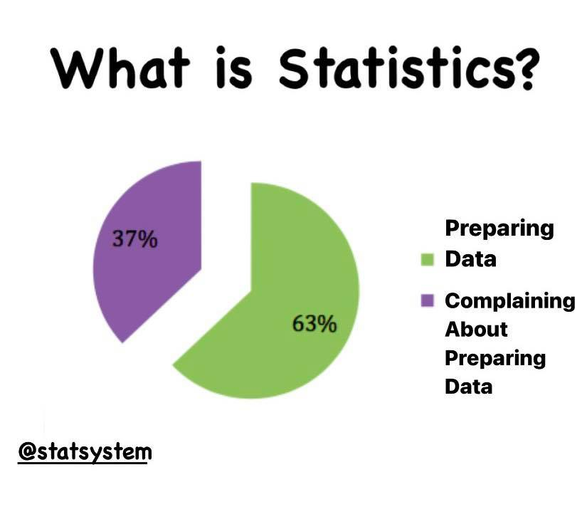
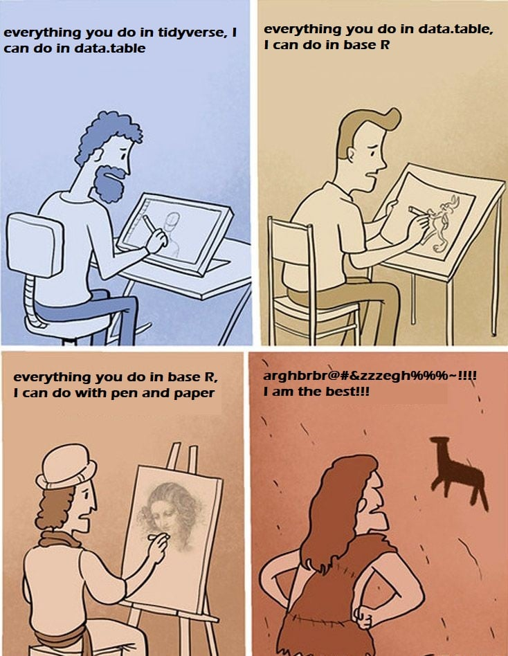
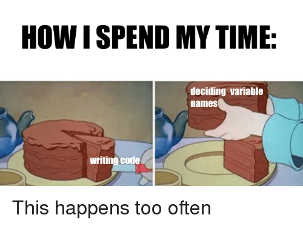

# Andre seminar, andre ting å lære!

I dag skal vi lære hvordan å bruke logiske tester, og å få data inn i det formatet vi ønsker. Fra forrige gang kan dere huske at vi lagde våre egne datasett. Som oftest er det jo ikke sånn at vi samler inn data selv, men vi får det fra noen andre. I min master f.eks. bruker jeg data fra World Value Survey. Siden de ikke blir laget på den måten jeg ønsker å bruke dem må jeg bruke en del på forandre formen på dataene. Når vi jobber med statistikk er det som oftest denne delen som faktisk tar tid. Å drive med analyse, kjøre regresjonsmodeller, sjekke modellene våre osv. går ganske fort når dataene er riktige. 



Det finnes ganske mange måter å gjøre "data-wrangling" (det fine ordet på å forandre data, google-tip) på. Et stort skille går på om du gjøre det i base-R eller med en pakke. Det finnes ganske mange pakker der ute som eksisterer for å gjøre dette enklere, men i dette seminaret vil vi fokusere på det som kalles tydiverse. Skulle du være interesert i å fortsette med R kan det være fint å se på alternativene, men jeg vil stå for at tidyverse er det beste. 




Tidyverse er teknisk sett ett sett med pakker laget for å fungere godt sammen. Nøyaktig hva som kommer fra de enkeltstående pakkene er som oftest ikke så veldig interesant, men skulle du trenge det står det alltid øverst i hjelpefilen. 


```r
#Før vi skal bruke en pakke må vi innstalere den, med install.packages() funksjonen
install.packages("tidyverse")
```

```r
#Hver gang vi skal bruke den må vi også kjøre library()
library(tidyverse)
```

```
## -- Attaching packages --------------------------------------- tidyverse 1.3.0 --
```

```
## v ggplot2 3.3.2     v purrr   0.3.4
## v tibble  3.0.4     v dplyr   1.0.2
## v tidyr   1.1.2     v stringr 1.4.0
## v readr   1.4.0     v forcats 0.5.0
```

```
## -- Conflicts ------------------------------------------ tidyverse_conflicts() --
## x dplyr::filter() masks stats::filter()
## x dplyr::lag()    masks stats::lag()
```


Nå som vi har pakkene inne, kan vi først se litt på hvordan å laste inn data. Data kommer i ganske mange filformater, og hvordan vi laster dem inn vil være avhengig av typen fil. Noen ganske vanlige, som f.eks. .csv, har R innebygget støtte for. Det finnes også datatyper som .rds som er laga nettopp for R. Filformater laga for andre progammer som f.eks. excel og xlxs må en ha egne pakker for. Når du derfor skal laste inn data må du først se på typen. Er du usikker på hvordan er det som oftest bare å google seg frem til det, det finnes garantert en løsning der ute!

Datatypen vi skal bruke i dette seminaret er .csv, eller "comma seperated values." Dette er rett og slett en tekstfil som inneholder alle dataene våre. For å laste inn dette bruker vi funksjonen read.csv()


```r
# read.csv() funksjonen fungerer sånn at du bruker <- for å lage et objekt, og så i parantesen skriver
#inn linken til filen. Dette kan enten være en fil på din data, f.eks. 
#read.csv("dokumenter/r-filer/data.csv")

#Eller som vi gjør her en link til internett. 
ESS <- read.csv("https://raw.githubusercontent.com/egen97/4020A_RSeminar/master/ESS_Selected.csv")
```

Om dere ser i enviornment nå vil dere se at vi har fått en data.frame som heter "ESS", og har 434065 observasjoner av 24 variabler. Dette er data fra the European Social Survey, en spørreundersøkelse som går i flere Europeiske land og stiller spørsmål relevant for samfunsvitenskapene. Noe av det første vi bør gjøre er å få en oversikt over hva dataene inneholder. En lett måte å gjøre det på er gjennom str() funksjonen. 


```r
str(ESS)
```

```
## 'data.frame':	434065 obs. of  24 variables:
##  $ Time_News                    : int  NA NA NA NA NA NA NA NA NA NA ...
##  $ Trust_People                 : int  7 6 0 8 8 0 5 6 7 4 ...
##  $ People_Fair                  : int  7 3 3 5 8 5 9 7 8 3 ...
##  $ Pol_Interest                 : int  3 1 2 2 3 1 3 2 3 3 ...
##  $ Trust_Police                 : int  10 5 8 9 4 6 6 7 8 5 ...
##  $ Trust_Politicians            : int  0 0 2 4 4 0 5 4 3 5 ...
##  $ vote                         : int  2 1 1 1 1 2 1 1 1 1 ...
##  $ Party_Voted_NO               : int  NA NA NA NA NA NA NA NA NA NA ...
##  $ Left_Right                   : int  6 6 5 5 5 NA NA 6 5 5 ...
##  $ Satisfied_Gov                : int  7 0 7 3 5 0 5 5 3 5 ...
##  $ Gov_Reduce_IncomDif          : int  2 1 2 4 4 1 NA 4 4 1 ...
##  $ LGBT_Free                    : int  1 1 1 3 2 1 NA 2 1 1 ...
##  $ Religous                     : int  8 5 7 7 10 3 8 1 6 5 ...
##  $ Climate_Human                : int  NA NA NA NA NA NA NA NA NA NA ...
##  $ Responsibility_Climate       : int  NA NA NA NA NA NA NA NA NA NA ...
##  $ Goverment_Climate            : int  NA NA NA NA NA NA NA NA NA NA ...
##  $ Basic_Income                 : int  NA NA NA NA NA NA NA NA NA NA ...
##  $ Important_Rules              : int  1 6 2 3 6 5 4 5 2 1 ...
##  $ Important_Equal_Oppurtunities: int  1 1 2 2 1 1 2 1 2 1 ...
##  $ Income                       : int  NA NA NA NA NA NA NA NA NA NA ...
##  $ Gender                       : int  1 1 2 1 2 2 2 2 1 2 ...
##  $ Age                          : int  54 50 63 44 41 63 75 41 47 52 ...
##  $ Country                      : chr  "AT" "AT" "AT" "AT" ...
##  $ essround                     : int  1 1 1 1 1 1 1 1 1 1 ...
```


Her ser vi med en gang hvilke variabler vi har, nanene, og hvilken type det er. Første variabel er "Time_News" en integer variabel, med NA som sine første observasjoner. 


# Variabler, observasjoner, og objektnavn



Når vi bruker større datasett inneholder datasettet ofte mangle flere variabler og observasjoner enn de vi ønsker å bryke i våre analyser, og variablene har navn som kan være vanskelig å huske f.eks. "Gov_Reduce_IncomDif." Det kan være lurt å fjerne de variablene og observasjonene vi ikke ønsker, og gi dem navn som er lette å forstå. 

For å gjøre dette kan vi bruke 3 funksjoner. 'select()' gjør at vi kan velge de variabene vi ønsker, 'filter()' gjør at vi kan hente de observasjonene vi ønsker, og 'rename()' gjør at vi får nye navn. Disse kan vi knytte sammen med '%>%' som kalles enn "pipe". Den tar output fra et utsang og gjøre det til input i det nesten. Vi kan se på det som ordet "så." La oss si at vi vil ha variablene "party_voted_norway", "LGBT_free", og "age" fra Norge i runde 8. 


```r
NO8 <- ESS %>% #Her sier jeg at NO8 skal komme fra ESS
  filter(Country == "NO" & essround == 8) %>% #Filter gjør at jeg kun får de observasjonene som har "NO" på country og 8 på
  select(Party_Voted_NO, LGBT_Free, Age) %>% #essround. Jeg bruker & (and) for å få at begge må være TRUE. Select() gjør at jeg
  rename(                                    #jeg kun får de tre variablene jeg velger ut.
    "Stem" = "Party_Voted_NO", #Her velger jeg nye navn, den kommer alltid sånn at formen er "Nytt navn" = "Gammelt navn"
    "LGBT_Rettigheter" = "LGBT_Free",
    "Alder" = "Age"
  )                                            
```


Nå har vi et nytt datasett, NO8. La oss begynne med å utforsøke datasettet litt. Den første måten å se datasettet på har vi gjort over. 'str()' gir oss navn på variablet og klasse. Andre funksjoner vi kan prøve er 'head()' og 'summary()'


```r
#Head funksjonen gir oss de første obeservasjonene i ett datasatt. 
head(NO8) #Så lenge datasettet ikke er for stort er dette en fin måte å utforske datasettet på. 
```

```
##   Stem LGBT_Rettigheter Alder
## 1    4                2    74
## 2   NA                5    17
## 3    2                1    54
## 4    3                1    50
## 5    3                1    25
## 6    4                2    43
```

```r
tail(NO8) #Head har også en motsatt funksjon, tail(), som gjør at vi kan se bunn av datasettet. 
```

```
##      Stem LGBT_Rettigheter Alder
## 1540    7                1    36
## 1541   NA                1    26
## 1542    3                2    29
## 1543    6                2    81
## 1544    8                1    44
## 1545    3                1    23
```

```r
#Vi kan også kjøre summary() på hele datasettet. Da får vi ut min/maks, kvartiler, og gjenomsnitt/median
#for alle variablene i datasettet. 
summary(NO8)
```

```
##       Stem        LGBT_Rettigheter     Alder      
##  Min.   : 1.000   Min.   :1.000    Min.   :15.00  
##  1st Qu.: 3.000   1st Qu.:1.000    1st Qu.:31.00  
##  Median : 5.000   Median :1.000    Median :47.00  
##  Mean   : 5.225   Mean   :1.571    Mean   :46.96  
##  3rd Qu.: 7.000   3rd Qu.:2.000    3rd Qu.:61.00  
##  Max.   :11.000   Max.   :5.000    Max.   :98.00  
##  NA's   :392      NA's   :5
```

# Plotting


En annen måte, og ofte bedre, å undersøke data på er gjennom plotting. Grafer gir oss ofte mye mer og mer intiutiv informasjon om dataene våre enn ren tekst. Plotting i R kan i utgangspunktet gjøres med 'plot()' funksjonen, men denne er ofte tungvin (og ikke like pen). Vi skal derfor bruke ggplot, en pakke som kommer med tidyverse laget spesifikt for å lage grafikk. Pakken er basert på det de kalles "Grammar of Graphics", som kan være verdt å google om du vil bli god på det! 

Ggplot gir oss mange muligheter til hvordan vi kan lage plottene våre, det viktigste er å forstå hvordan systemet fungerer. Først kan vi begynne med det som kalles et "density-plot." Et density-plot gir oss muligheten til å se gjennomsnitt og spredning på en numerisk variabel. Altså kan vi å mye av de samme dataene som vi får når vi bruker 'summary()' funksjonen. Dette plottet er også veldig nyttig når vi skal jobbe med statistiske tester senere!


```r
#Alle plott starter med at vi definerer data-sett, og variabler. La oss se på distribusjonen av alder
#i Norge. Altså vil vi ha data settet NO8 og variabelen "Alder".

ggplot(NO8, aes(Alder))+ #Her skriver jeg først navnet på datasettet. Så bruker jeg funksjonen aes() (aesthetic) for variabelen
  geom_density() #Etter en linje skriver jeg +, den brukes på samme måte som %>% for at neste linje skal følge forrige
```

<!-- --> 

```r
                 #geom_ bestemmer typen plot vi skal ha. Her er det mange å velge mellom, så lurt å bla igjennom og se hva
                 #du får! Her bruker jeg density og får altså et density plott. 
```

Så, hva sier dette et plottet oss? Det første vi kan se er at fordelingen er høyreskjev. Altså er median noe høyere enn gjenomsnitt, og det er flere observasjoner med lavere verdier på alder. Dette gir jo også mening. Vi kan se a maksverdien er noe under 100, mens minimum er litt under 25. Gjenomsnittet er rundt 50 år. Når vi tenker over hvordan befolkningen ser ut er det flere mellom 25 og 60 enn mellom 60 og 100. Vi kan også se her at de fleste er mellom 30 og 60 år. Om dere ser på summary vil dere legge merke til at dette er mellom 1. og 2. kvartil. 


Plottet vårt akkurat nå er veldig stygt. Vi kan gjøre noen små endringer for å få det finere; legge til tittler, fikse bakgrunn, og mer. 

```r
#Plott kan vi lagre som objekter det kan gjøre det lettere å jobbe med videre 
AlderPlot <- ggplot(NO8, aes(Alder))+
  geom_density() 

#Her lager jeg akkurat det samme plottet, men lagrer det som et objekt med navn "AlderPlot". I enviornment vil dere se at dette
#blir lagret som et "list" objekt. 

#I første omgang skal vi se på to ting, labels og themes. Labels gjør at vi kan legge til tekst, og themes gir et tema til 
#bakgrunn, farger, osv. 

AlderPlot <- AlderPlot + labs(y = "", x = "Alder, numerisk", title = "DensityPlot for Alder", subtitle = "ESS Norge, runde 8")
#Labs gjør at vi kan legge til forskjellige typer tekst, her sier jeg først at y-aksen ikke skal ha noen (ved å sette "" tomt),
#så at X aksen skal ha "Alder, numerisk" og så tittler og undertittel 

#Så vil jeg legge til et theme. Her finnes det mange å velge imellom, så det er verdt å sjekke ut hvem dere liker best!
#Kan også være en god ide å se på ggthemes pakken, som kommer med mange fler og også mer muligheter til å tilpasse selv. 

AlderPlot <- AlderPlot + theme_classic()

#Til slutt kan vi bare kjøre objektet, og se ossen det ser ut nå:
AlderPlot
```

<!-- --> 

